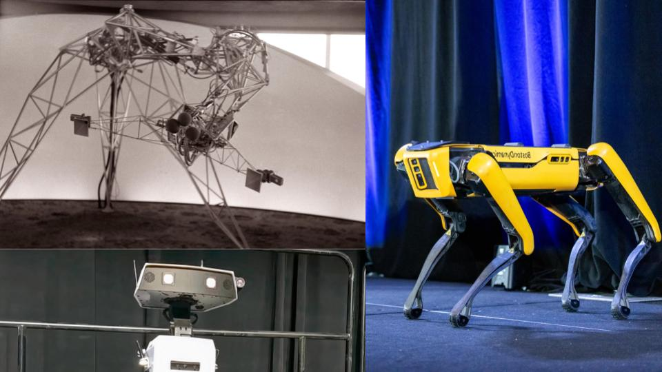

# _Creative Robotics_  VIS 147B: Electronic Technologies for Art II - Winter 2026

[Schedule](#schedule) | [Description](#description) | [Tutorials](#tutorials) | [Grading](#grading) | [Policies](#policies) | [Resources](#resources) | [References](#references)

*Clockwise from top left: Hu et al. [ELEGNT: Expressive and Functional Movement Design for Non-Anthropomorphic Robot](https://machinelearning.apple.com/research/elegnt-expressive-functional-movement) (2025); Edward Ihnatowicz [Senster](https://evoluon.dse.nl/senster-e.htm) (1970); Moritz Bächer and Disney Research Zurich [Bipedal WALL-E Robot](https://www.youtube.com/watch?v=-cfIm06tcfA) (2023); Perry Nightingale from WPP with Boston Dynamics Spot [Dancing Robots and Generative AI: The Future of Creativity](https://www.adobe.com/max/2023/sessions/na-dancing-robots-and-generative-ai-the-future-of-s6151.html?linkId=100000254219236)(2023)*

# Description

A continuation of the electronics curriculum. Design of programmable microcontroller systems for creating artworks that are able to respond to complex sets of input conditions, perform algorithmic and procedural processing, and generate real time output. Program or materials fees may apply. Purchase of components kit required. Two production-course limitation.

For Winter 2026 this course will focus on design and development of mechatronic systems that demonstrates expressive behavior, using *programmable microcontrollers, sensors and actuators. Topics include the development of expressive behavior through visual design and mechanical motion, robotics, character design and modelling techniques (2d sketch, 3d digital and physical models). This course will be taught in parallel with Prof. Mullins' MAE 190. This collaboration is intinded to offer engineers and visual arts students an opportunity to learn from both disciplines. 

## Instructors
Professor Robert Twomey - Instructor of Record for VIS 147B 
Department of Visual Arts 
Email: [rtwomey@ucsd.edu](mailto:rtwomey@ucsd.edu)

Professor Jennifer Mullin - Instructor of Record for MAE 190 
Department of Mechanical and Aerospace Engineering  
Email: [jmullin@ucsd.edu](mailto:jmullin@ucsd.edu)

## Time and Location

- **Class:** Tuesdays, 12:30 – 3:20 p.m.
- **Location:** [SME](https://map.concept3d.com/?id=1005#!ct/18312,63891,65653?s/SME_Main) 302 (Classroom opposite Envision Maker Space)
- **Office Hours:** - TBD likely Wednesdays, 11:00 – 12:00 p.m. in SME 302
- **Discussion Section** - (optional) Thursdays 1-1:50pm.
- **Canvas:** ([link](https://canvas.ucsd.edu/courses/73110))

**Prequisites:** None.

## Course Materials and Tools

**Textbook**: There is no textbook required for this course. We will upload lecture materials, notes and resource materials to Canvas.

**Technology requirement**: a computer and/or a tablet, or smartphone that can run educational apps are recommended for this seminar.

**Required Hardware**: Students are asked to purchase/provide the ESP32 Dev Board along with other basic electronic components used throughout this course including the final project. The complete list is available here: [Material List](https://docs.google.com/document/d/16meO_fiGe-2IXtZatGv2IwkkCf8VM45hPuA-N4YwOOE/edit?usp=sharing)

## Course objectives
Students who complete the course will:
-	Apply a working understanding of foundational mechanical, electrical and control systems that are associated with interactive visual arts and robotic applications.
-	Develop a conceptual design, digital representation, and a functioning physical mechatronic model through the use of a variety of digital and physical fabrication resources.
-	Demonstrate a conceptual understanding of control systems, cybernetics, and expressivity in robot design.
- Be able to think critically about visual design, human-robot interaction and issues of representation in robot design.

# Schedule
(Subject to change. Check back for most up to date information)

| Week | Topic |
|------|-------|
| 1 | **[Intro, Overview, and Imagination Board](sessions/week1.md)**   - Overview of Course & Policies;   - Art and Engineering, Creative Robotics;   - Imagination Board and Setup;   - Assign Reading 1 - Braitenberg _Vehicles_;   - Assign HW1 |
| 2 | **[Making Things Move](sessions/week2.md)**   - Analog Input/Output;   - Expressive Behavior, Robotic Surrogates, and Portraiture;   - Assign Project 1;   - Assign HW2;   - Assign Reading 2 - McCarthy _Ascribing Mental Qualities to Machines_|
| 3 | **[Sensors and Sensations](sessions/week3.md)**   - Sensors;   - Cybernetics and Control Systems;   - Project 1 Work Time;   - Assign Reading 3 N.Weiner _Cybernetics_ (TBD)   - Assign HW3;   - Assign Final Project|
| 4 | **[Choreography and Expressive Movement](sessions/week4.md)**   - Project 1 Critique;   - Assign Reading 3: Cuan Choreobotics   - Assign HW 4   - Finish Project 1 |
| 5 | **[Behaviors](sessions/week5.md)**   - Programming Movement   -Assign Reading 4 - _ELEGNT_ 2024   - Critique Midterm Project |
| 6 | **[Situated Computing](sessions/week7.md)**   - Smart Objects; Ubiquitous Computing; Smart Environments   -  Assign HW 5   - Assign Reading 5: Weiser _Open House_, J.G.Ballard _Thousand Dreams of Stella Vista_|
| 7 | **[Companions](sessions/week6.md)**   - Networked Arduino;   - Distributed Sensors;   - Final Project Pitches with Proof of Concept   - Assign HW 6   - Assign Reading 6: _Designing Sociable Robots_ |
| 8 | **[Affective Interfaces - Once More with Feeling(s)](sessions/week8.md)**   -Final Project Functional Prototypes;   - Assign HW 7   - Assign Reading 7: Dobson _Machine Therapy_ (excerpts)|
| 9 | **Final Project Work Time**   - In class work on Project 2 |
| 10 | **Work Time and Working Critique**   - Work Time and Working Critique |
| Finals | **Final Critique and Documentation**   - Final critique (_in person_)   - Submit Documentation |

# Grading

Work will be evaluated on the quality of concept, the degree of experimentation (both aesthetic and technical), and final realization (again, aesthetic and technical). Prompts and rubrics will be provided with more specific details regarding each assignment and breakdowns

Final grades are determined using the following grade breakdown:

## Graded Activities
- 35% Exercises – approximately 6 weekly exercises
- 45% Projects – midterm and final at approx 20 and 25% respectively
- 10% Digital Sketchbook - cumulative
- 10% Participation

## Grading Scale
A+ = 97-100 | A = 94-97 | A- = 90-94  
B+ = 87-90 | B = 84-87 | B- = 80-84  
C+ = 77-80 | C = 74-77 | C- = 70-74  
F = below 60% 

(In keeping with the UCSD Visual Arts grading scale, any grade below C- is considered a failing grade.)

## Grading Details

Work will be evaluated on the _quality of concept_, the _degree of experimentation_ (aesthetic and technical), and the _final realization_ (again, aesthetic and technical). The follow describes the kind of effort that would earn you each grade.

**A – Excellent**
Excellent projects present _clear, original, and compelling_ concepts. They demonstrate _strong experimentation_—pushing both aesthetic and technical boundaries—and result in a _highly resolved, polished final work_. The project reflects a deep engagement with the assignment prompt and an ambitious creative vision. You’ve thoughtfully integrated feedback and shown critical awareness of your process and outcome.

**B – Good**
Good projects present _well-developed_ and _thoughtful concepts_. They show _solid experimentation_ with some risks taken, and result in a _well-executed and coherent final work_. The project meets all requirements and demonstrates care and understanding in both craft and presentation. Feedback has been applied effectively, though not always extensively.

**C – Satisfactory**
Satisfactory projects present _clear but limited concepts_. Experimentation is present but _conventional or uneven_, and the final realization may feel _incomplete or underdeveloped_. The work meets basic requirements but lacks depth, polish, or full engagement with the creative potential of the assignment. Feedback may not have been fully addressed.

**F – Failing**
Failing projects show _minimal concept development_, _little to no experimentation_, and _poor or incomplete realization_. The work may not meet assignment requirements, demonstrate technical competence, or communicate a clear idea. It reflects a lack of engagement with the project’s creative and developmental process.

# Policies

Course-specific policies and rules.

| [Attendance](#attendance) |	[Late Work](#late-work)	| [Academic Integrity](#academic-integrity) | [Other People’s Code](#other-peoples-code) | [Accommodations](#students-with-disabilities) | [UCSD Course Policies and Resources](#ucsd-course-policies-and-resources) |

## ICAM Policies
File naming conventions and submissions. More [TK].

## Attendance
On-time attendance is required as well as work inside and outside of section. Please notify your instructor in advance if you must be absent for illness or family emergency. Any absences must be cleared with the instructor, or justified with written documentation (e.g. letter from team, etc.). We do not differentiate between mental and physical health and in either case please be in communication for when you need to take a day off. **After a student misses a week’s worth of classes each subsequent missed class will result in the reduction of the final grade by a full letter grade (i.e., A to B, B- to C-).** Excessive tardiness or leaving early will also impact your grade and will follow the same rubric.

On-time attendance is required. Lateness or leaving early, when not cleared with the instructor, will also impact your participation grade. Lateness will be counted as 80% for your participation grade for the day.

## Late Work 
**Late Work Grading Policy**. Late work will be docked 5% for each day they are late (if an assignment is two days late, the grade will be docked 10%). An assignment submitted after the due date time on the due date will still be docked 5%. The lowest possible grade for late work is 70%, which means that for an assignment submitted more than 6 days late, no more than 30% will be docked, but the maximum grade you will receive is 70%. Details about submission format and due date are given in Canvas. 

**Excused Late Work**. Requests to submit late work for special circumstances must be approved by your instructor at least 24 hours before the due date and time. Any late requests made less than 24 hours before the assignment is due may still be subject to a lateness penalty. We do not distinguish between mental and physical health. **Email your instructor, 24 hours in advance, explaining generally the reason you are missing class and your plans for making up any missed lecture, activity, and assignment**. 

An assignment may receive an F if a student does not participate in every phase of the development of the project and meet all deadlines for preliminary materials (proposals, drafts, etc.).  Failure to submit any of the graded course assignments is grounds for failure in the course.  

## Academic Integrity
Integrity of scholarship is essential for an academic community. The University expects that both faculty and students will honor this principle and in so doing protect the validity of University intellectual work. **For students, this means that all academic work will be done by the individual to whom it is assigned, without unauthorized aid of any kind.** [http://senate.ucsd.edu/Operating-Procedures/Senate-Manual/Appendices/2](http://senate.ucsd.edu/Operating-Procedures/Senate-Manual/Appendices/2)

> Academic Integrity is expected of everyone at UC San Diego. This means that you must be honest, fair, responsible, respectful, and trustworthy in all of your actions. Lying, cheating, or any other forms of dishonesty will not be tolerated because they undermine learning and the University’s ability to certify students’ knowledge and abilities. Thus, any attempt to get, or help another get, a grade by cheating, lying or dishonesty will be reported to the Academic Integrity Office and will result in sanctions. **_Sanctions can include an F in the class and suspension or dismissal from the University._** So, think carefully before you act. Before you act, ask yourself the following questions: a: is my action honest, fair, respectful, responsible, and trustworthy, and b) is my action authorized by the instructor? If you are unsure, don’t ask a friend, ask your instructor, instructional assistant, or the Academic Integrity Office. You can learn more about academic integrity at [academicintegrity.ucsd.edu](https://academicintegrity.ucsd.edu/).

(Source: Bertram Gallant, T. (2017). Teaching for integrity. UC San Diego Academic Integrity Office.)

## Other People’s Code
**If you use a piece of code from the p5 reference or another piece of publicly available code, you must cite your use of it at the top of your code file as a comment**. Include a link to the original code file, the author, and the date. 

**This includes generated code**. You are allowed to use LLMs, [TritonGPT](https://blink.ucsd.edu/technology/ai/tritongpt/index.html), other Generative AI tools as part of your coding process, however **you must disclose this usage**. Add comments in your code indicating which parts were generated, and how you asked the system to help.

Failure to properly cite external resources (included generative AI) will drop your grade.

## Students with Disabilities

Students requesting accommodations for this course due to a disability must provide a current Authorization for Accommodation (AFA) letter issued by the Office for Students with Disabilities (OSD) which is located in University Center 202 behind Center Hall. Students are required to present their AFA letters to Instructors and to the OSD Liaison in the MAE/VIS department in advance so that accommodation may be arranged.           

Please, if possible, send your OSD accommodations letter to your instructor before the end of week 2 (Friday, April 11) so we can arrange for your accommodations.

### Office for Students with Disabilities (OSD)

858.534.4382 | [osd@ucsd.edu](mailto:osd@ucsd.edu) | [https://disabilities.ucsd.edu/](https://disabilities.ucsd.edu/)

## UCSD Course Policies and Resources

Students are responsible for knowing the university academic policies and resources found on [this page](https://catalog.ucsd.edu/academic-regulations.html):
- Adding and dropping courses
- Exams
- Grades and grade points

## Land Acknowledgment

This public acknowledgment serves to honor and respect Indigenous peoples and their land on which our campus resides. UC San Diego was built upon the territory of the Kumeyaay Nation. From time immemorial, the Kumeyaay people have been a part of this land. Today, the Kumeyaay people continue to maintain their political sovereignty and cultural traditions as vital members of the San Diego community.

# Tutorials
## Class-specific tutorials
- [Getting Started with the Envision Dev Board](tutorials/getting-started-dev-board.md)
- [Hands-On with Mechanical Movement](tutorials/gears-and-mechanisms.md)
- [Sensors with the Dev Board](tutorials/dev-board-sensors.md)
- [Actuators with the Dev Board](tutorials/dev-board-actuators.md)
## General Tutorials
- [Rhino Quickstart](tutorials/rhino3d.md)
- [Laser Cutting Guide](tutorials/laser-cutting.md)

# Resources

## Fabrication Facilities
- **Envision Makerspace:** [https://jacobsschool.ucsd.edu/envision](https://jacobsschool.ucsd.edu/envision)
  - EnVision is located on the 3rd floor of the SME building, rooms 301 - 306
  - We are open M-F, 9a - 8p and Sat/Sun, 12p - 4p
- **DIB Makerspace** (Design Innovation Building) [https://makerspace.ucsd.edu/](https://makerspace.ucsd.edu/)
- Craft Center [https://craftcenter.ucsd.edu/](https://craftcenter.ucsd.edu/)
- Undergraduate Wood and Metal Shop (Mandeville) [https://visarts.ucsd.edu/facilities/undergrad.html#Shops](https://visarts.ucsd.edu/facilities/undergrad.html#Shops)
- ECE Makerspace [https://ece.ucsd.edu/makerspace](https://ece.ucsd.edu/makerspace)

## 3D Modeling Software
- [onshape](https://www.onshape.com/en/) (browser)
- [fusion360](https://www.autodesk.com/products/fusion-360/) (mac, windows)
- [shapr3d](https://www.shapr3d.com/) (iPad, mac, windows)
- [nomad sculpt](https://nomadsculpt.com/) (iPad, android)
- [tinkercad](https://www.tinkercad.com/3d-design) (browser)

## Fabrication Equipment
- [Prusa printers](https://www.prusa3d.com/category/original-prusa-i3-mk3s/) (DIB, Envision)
- [Ultimaker](https://ultimaker.com/software/ultimaker-cura/) (DIB??)
- Muse Laser Cutter (Envision)
- Universal Laser Cutter (DIB)
- Fablight (DIB)
- CNC Router (DIB)
- CNC Mill and Metal Shop (DIB)

## Materials
- [Where to get Materials](references/materials.md)
- Students are asked to purchase/provide the ESP32 Dev Board along with other basic electronic components used throughout this course including the final project. 
- The complete list is available here: [Material List](https://docs.google.com/document/d/16meO_fiGe-2IXtZatGv2IwkkCf8VM45hPuA-N4YwOOE/edit?usp=sharing)

# References

[TK]