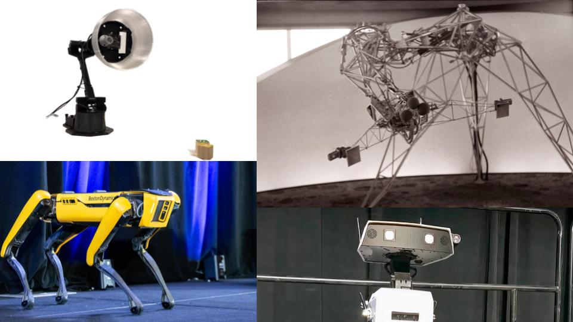

# VIS 87 / MAE 87: Creative Robotics: Engineering Expression
[Schedule](#schedule) | [Description](#description) | [Tutorials](#tutorials) | [Grading](#grading) | [Policies](#policies) | [Resources](#resources) | [References](#references)

*Clockwise from top left: Hu et al. [ELEGNT: Expressive and Functional Movement Design for Non-Anthropomorphic Robot](https://machinelearning.apple.com/research/elegnt-expressive-functional-movement) (2025); Edward Ihnatowicz [Senster](https://evoluon.dse.nl/senster-e.htm) (1970); Moritz Bächer and Disney Research Zurich [Bipedal WALL-E Robot](https://www.youtube.com/watch?v=-cfIm06tcfA) (2023); Perry Nightingale from WPP with Boston Dynamics Spot [Dancing Robots and Generative AI: The Future of Creativity](https://www.adobe.com/max/2023/sessions/na-dancing-robots-and-generative-ai-the-future-of-s6151.html?linkId=100000254219236)(2023)*

# Description

In this hands-on seminar we will explore the connection between art and engineering. We will apply the fundamental topics and skills covered in this seminar to create interactive robotic avatars. Topics include the development of expressive behavior through visual design and mechanical motion, character design and fabrication, and the use of a microcontroller, sensors and actuators. We will use a design process to guide the avatar development from a concept to a functional robotic sculpture.

## Details

- **Instructors:**
  - Dr. Jennifer Mullin, Department of Mechanical and Aerospace Engineering
  - Dr. Robert Twomey, Department of Visual Arts
- **Class:** Wednesday 1-3pm
  - 8-10 hours total for the quarter
  - (meets weeks 2, 4, 5, 7, 9)
- **Location:** [SME](https://map.concept3d.com/?id=1005#!ct/18312,63891,65653?s/SME_Main) 302 (Classroom opposite Envision Maker Space)
- **Office Hours:**
  - off weeks (1, 3, 6, 8) (Envision)
- **Canvas:** [TK]

# Course Materials and Tools

Textbook: There is no textbook required for this course. We will upload lecture materials, notes and resource materials to Canvas.

Technology requirement: a computer and/or a tablet, or smartphone that can run educational apps are recommended for this seminar.

## Course objectives
Students who complete the course will:
-	Gain a working understanding of mechanics, linkages, and mechanical automata.
-	Develop facility with digital fabrication, hand craft, and mechatronic automation.
-	Develop a conceptual understanding of control systems, cybernetics, and expressivity in robot design.
- Be able to think critically about human-robot interaction and issues of representation in robot design.

**Prequisites:** None.

# Schedule
(Subject to change. Check back for most up to date information)

| Week | Topic |
|------|-------|
| 2 | **Getting Started**   - Course Structure; Sign up for Discord; Get started with Dev Board + Servo;   - **HW** start vision board; **HW** complete dev board challenge |
| 4 | **Define your Avatar**   - Feedback on avatar concepts; Hands on with mechanical movement; Automata activity;   - **HW** cardboard automata; **HW** Explanatory sketch for avatar communicating form and function |
| 5 | **Systems Design**   - Lecture cybernetics, Lecture project management; Hands on with sensors and actuators   - **HW** Build, test, and refine electromechanical mockup; **HW** List of materials for project |
| 7 | **Working Session**   - Time and support for building and testing Avatar   - **HW** Complete your avatar for week 9 presentations |
| 9 | **Presentation Party**   - Teddy bears' coming out picnic   - **HW** Final documentation submission |
| Finals | **Submit Documentation** |

# Tutorials
## Class-specific tutorials
- [Getting Started with the Envision Dev Board](tutorials/getting-started-dev-board.md)
- [Hands-On with Mechanical Movement](tutorials/gears-and-mechanisms.md)
- [Sensors with the Dev Board](tutorials/dev-board-sensors.md)
- [Actuators with the Dev Board](tutorials/dev-board-actuators.md)
## General Tutorials
- [Rhino Quickstart](tutorials/rhino3d.md)
- [Laser Cutting Guide](tutorials/laser-cutting.md)

# Grading

This course provides a hands-on introduction to visual design, mechanical design, electronics, and fabrication. No prior experience in these skills is required. Students will have opportunities to develop and apply their technical and artistic skills through in-class activities and the avatar project.

Work will be evaluated on the quality of concept, the degree of experimentation (both aesthetic and technical), and final realization (again, aesthetic and technical). Prompts and rubrics will be provided with more specific details regarding each assignment.

Grading in this course is Pass/Fail. Final grades are determined using the following grade breakdown:

## Graded activities
- 50% - Attendance and participation (4 out of 5 sessions) - Failure is missing more than 1 unexcused abasence.
- 40% - Homework -  satisfactory completion of all homework assignments. 
- 10% - Final Presentation and Submission - present your functional avatar (Week 9) and getting critique

# Policies

Course-specific policies and rules.

| [Attendance](#attendance) |	[Late Work](#late-work)	| [Academic Integrity](#academic-integrity) | [Other People’s Code](#other-peoples-code) | [UCSD Course Policies and Resources](#ucsd-course-policies-and-resources) |

## Attendance
On-time attendance and active participation are required for the five scheduled sessions. Class will meet in person on week 2 (4/9), week 4 (4/23), week 5 (4/30), week 7 (5/14), and week 9 (5/28). If you are not able to attend a session, please contact the instructors directly and in advance. **A failing grade will be assigned for two or more unexcused absences.**

Contributions to class discussions and active participation in small group work are essential to both the momentum of the course and the development of your ideas. This requires that you come to class prepared (having completed assigned reading and writing) and ready to participate in class activities. This course is based on project-based learning, and you are expected to contribute as a responsible member of the community.

No makeup will be given for missed class activities due to unexcused absence or tardiness to class. Please provide supportive documents (such as a doctor's letter if absence is due to a medical emergency) to support the makeup request.

## Sick/Illness Policy
If you are feeling sick, please take proper precautions and follow all university policies and guidelines, which can be found [here](https://blink.ucsd.edu/safety/resources/public-health/index.html). Please notify the instructors if you will be missing a class or section due to illness.  **For an excused absence, you will be asked by your instructor to provide documentation.** This is due to the hands-on, interactive and collaborative nature of this course, where your active in-person participation is required for you to be successful.

## General Assignments

Assignments are posted on the Canvas course site with essential details and due dates. If something doesn’t look right and/or you have questions, please ask the instructors.

## Late Work
Students are expected to complete all assignments on time. Assignments are due in class and via online submission, as specified in assignment descriptions.

If an assignment is not submitted in class on the date due, it will be considered late and will lose one 5% for each day or part of a day past the due date. Any late submissions must be approved by your instructors well in advance of the due date.

## Academic Integrity 
Integrity of scholarship is essential for an academic community. The University expects that both faculty and students will honor this principle and in so doing protect the validity of University intellectual work. For students, this means that all academic work will be done by the individual to whom it is assigned, without unauthorized aid of any kind. [http://senate.ucsd.edu/Operating-Procedures/Senate-Manual/Appendices/2](http://senate.ucsd.edu/Operating-Procedures/Senate-Manual/Appendices/2)

### Other People's Code

We will use many open source resources to make our work. It is ok to use others’ code, or their 3d models. However, **you need to cite your sources**, and **you need to do transformative work/make it your own**.

## Students with Disabilities

Students requesting accommodations for this course due to a disability must provide a current Authorization for Accommodation (AFA) letter issued by the Office for Students with Disabilities (OSD) which is located in University Center 202 behind Center Hall. Students are required to present their AFA letters to Instructors and to the OSD Liaison in the MAE/VIS department in advance so that accommodation may be arranged.           

Please, if possible, send your OSD accommodations letter to your instructor before the end of week 2 (Friday, April 11) so we can arrange for your accommodations.

### Office for Students with Disabilities (OSD)

858.534.4382 | [osd@ucsd.edu](mailto:osd@ucsd.edu) | [https://disabilities.ucsd.edu/](https://disabilities.ucsd.edu/)

## Grading Scale

Pass / No Pass (a passing grade is C and above — 70%)

Here is a description of the kind of participation in the course that would earn you an A, B, C, etc. Your instructor may use pluses and minuses to reflect your participation more fairly, but this is a general description for each letter grade.

**A - Excellent**

Excellent participation is marked by near-perfect attendance and rigorous preparation for class work. You respond to questions and activities with enthusiasm and insight, and you listen and respond thoughtfully to your peers. You submit assignments on time, adhering to posted requirements, and demonstrate a thorough engagement with the assignment. You respond creatively to any feedback you receive (from both your peers and instructor). You are an active contributor to the classroom community.

**B - Good**

Good participation is marked by near-perfect attendance and thorough preparation for class. You respond to questions with specificity and make active contributions to class. You submit assignments on time and demonstrate a thorough engagement with the assignment. You respond effectively to the feedback you receive (from both your peers and instructor). You are a regular and reliable contributor to the classroom community.

**C - Satisfactory**

Satisfactory participation is marked by regular attendance and preparation for class. You respond to questions when prompted and participate in classroom activities, though you may sometimes be distracted. You are present in class, with few absences, and have done some of the work some of the time. You submit assignments and make some efforts toward revision proposals and final submission. You are involved in classroom activities, but you offer minimal feedback, and you may not always contribute fully to classroom community.

**F - Failing**

Failing participation is marked by excessive absences, a habitual lack of preparation, and failure to engage in classroom activities and development processes.

Final grades will be given based on the scale (below) at the instructor’s discretion.

| Letter Grade | Grade Points | Pass/Fail |
|-----|-----|-----|
| A | 90 to 100 | P |
| B | 80 to 89 | P |
| C | 70 to 79 | P |
| D | 60 to 69 | F | 
| F | 59 or olower | F |

## Academic Integrity

Academic Integrity is expected of everyone at UC San Diego. This means that you must be honest, fair, responsible, respectful, and trustworthy in all of your actions. Lying, cheating, or any other forms of dishonesty will not be tolerated because they undermine learning and the University’s ability to certify students’ knowledge and abilities. Thus, any attempt to get, or help another get, a grade by cheating, lying or dishonesty will be reported to the Academic Integrity Office and will result in sanctions. **_Sanctions can include an F in the class and suspension or dismissal from the University._** So, think carefully before you act. Before you act, ask yourself the following questions: a: is my action honest, fair, respectful, responsible, and trustworthy, and b) is my action authorized by the instructor? If you are unsure, don’t ask a friend, ask your instructor, instructional assistant, or the Academic Integrity Office. You can learn more about academic integrity at academicintegrity.ucsd.edu.

(Source: Bertram Gallant, T. (2017). Teaching for integrity. UC San Diego Academic Integrity Office.)

## UCSD Course Policies and Resources

Students are responsible for knowing the university academic policies and resources found on [this page](https://catalog.ucsd.edu/academic-regulations.html):
- Adding and dropping courses
- Exams
- Grades and grade points

## Land Acknowledgment

This public acknowledgment serves to honor and respect Indigenous peoples and their land on which our campus resides. UC San Diego was built upon the territory of the Kumeyaay Nation. From time immemorial, the Kumeyaay people have been a part of this land. Today, the Kumeyaay people continue to maintain their political sovereignty and cultural traditions as vital members of the San Diego community.

# Resources

## Fabrication Facilities
- **Envision Makerspace:** [https://jacobsschool.ucsd.edu/envision](https://jacobsschool.ucsd.edu/envision)
  - EnVision is located on the 3rd floor of the SME building, rooms 301 - 306
  - We are open M-F, 9a - 8p and Sat/Sun, 12p - 4p
- **DIB Makerspace** (Design Innovation Building) [https://makerspace.ucsd.edu/](https://makerspace.ucsd.edu/)
- Craft Center [https://craftcenter.ucsd.edu/](https://craftcenter.ucsd.edu/)
- Undergraduate Wood and Metal Shop (Mandeville) [https://visarts.ucsd.edu/facilities/undergrad.html#Shops](https://visarts.ucsd.edu/facilities/undergrad.html#Shops)
- ECE Makerspace [https://ece.ucsd.edu/makerspace](https://ece.ucsd.edu/makerspace)

## 3D Modeling Software
- [onshape](https://www.onshape.com/en/) (browser)
- [fusion360](https://www.autodesk.com/products/fusion-360/) (mac, windows)
- [shapr3d](https://www.shapr3d.com/) (iPad, mac, windows)
- [nomad sculpt](https://nomadsculpt.com/) (iPad, android)
- [tinkercad](https://www.tinkercad.com/3d-design) (browser)

## Fabrication Equipment
- [Prusa printers](https://www.prusa3d.com/category/original-prusa-i3-mk3s/) (DIB, Envision)
- [Ultimaker](https://ultimaker.com/software/ultimaker-cura/) (DIB??)
- Muse Laser Cutter (Envision)
- Universal Laser Cutter (DIB)
- Fablight (DIB)
- CNC Router (DIB)
- CNC Mill and Metal Shop (DIB)

## Materials
- [Where to get Materials](references/materials.md)

# References

[TK]