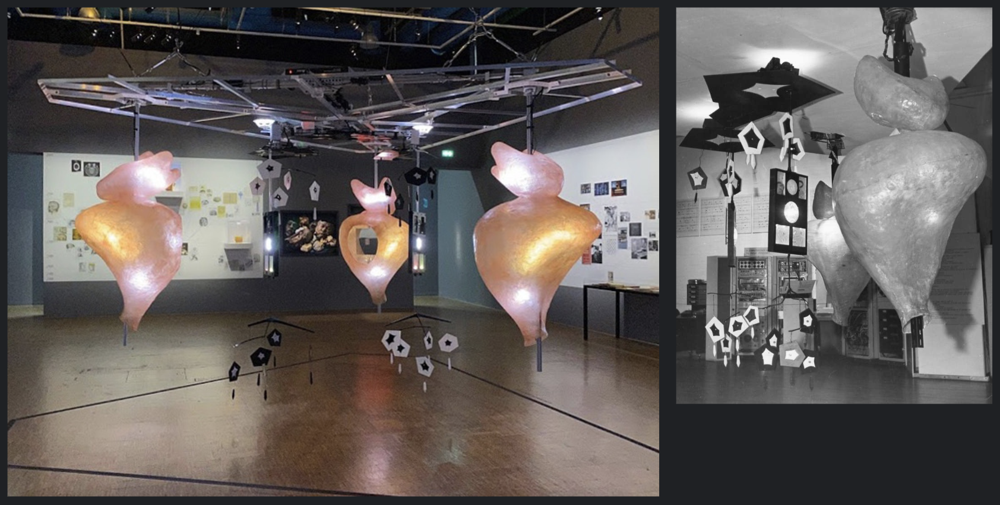

<small><i>Gordon Pask’s COLLOQUY OF MOBILES at the Institute for Contemporary Art in London, part of an exhibition called Cybernetic Serendipity in 1968 ([link](https://www.colloquyofmobiles.com/))</i></small>

# Sensing and Control: Even Machines As Simple as Thermostats

In his 1969 essay arguing in favor of Strong Artificial Intelligence, John McCarthy ascribed human qualities of belief, desire, and intention to simple sensors and electronics. In fact, he said: "Even machines as simple as thermostats can be said to have beliefs." ([link](http://jmc.stanford.edu/articles/ascribing/ascribing.pdf))

For this exercise, we want you to make a functional circuit of a machine that appears to have beliefs/feelings. It should incorporate one simple sensor (distance, temperature, light), and some simple output (servo, geared DC motor, or other like buzzer). 

You will write simple code that reads in the input sensor and responds to that input with some behavior. As you did in our other exercises, think about how a simple system can communicate with very limited means. Here we are adding a sensor as way of responding to the world. You will combine parts of the Knob, Sweep, rangefinder, and other examples from the past sessions.

# Submission
1. Canvas:
   - Arduino code as .zip file. 
   - Photo(s) of your circuit.
   - Video documenting your sensing-actuation construction in action.
   - (use the naming convention _hw3_Lastname_1.zip_, _hw3_Lastname.jpg_ and _hw3_Lastname.mp4 for the files.)

2. Sketchbook Updates:
   - add images of your circuit + devices, Rhino/STL files for anything fabricated, text describing your process.

DUE: 1/27/2026, noon. See Canvas.

# References
- [TK]