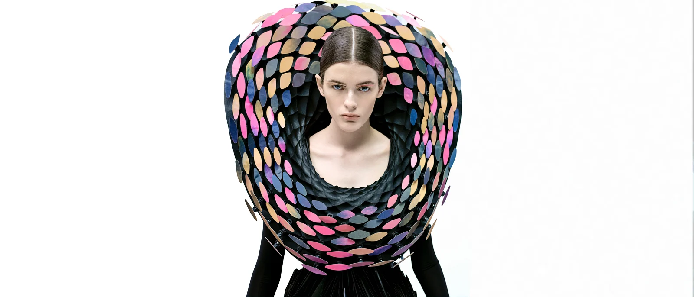
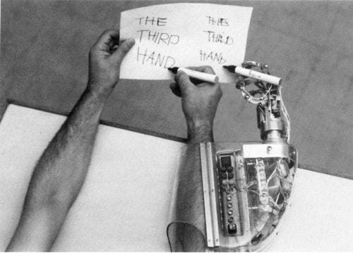
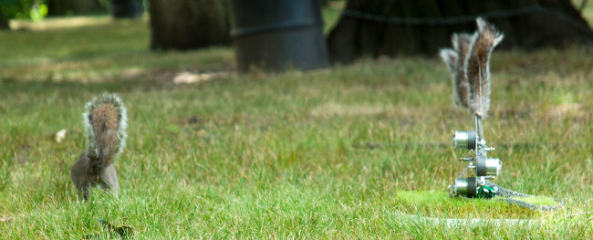
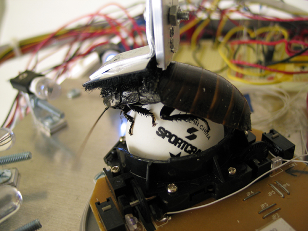

# Augmentation

For this project you will design an augmentation. This could be a wearable for a person, a prosthetic for an animal, or an augmentation to an object. Your augmentation will have 3 Degrees of Freedom (DOF). And it should demonstrate expressive movement, i.e. the way that it moves should create a feeling, communicate a state, establish a relationship with a viewer.

# Design Considerations
1. Ideation:
   - What is the target for your augmentation? Is it a wearable for a person, a prosthetic for an animal, an augmentation of an object? (Discuss)
   - How will it attach?
   - What types of motion will it use? (servos, DC motors with wheels, etc.)
2. What does the augmentation communicate? (for instance, Ian Ingram's piece below communicates **danger** in squirrel tail language). Remember our theme of expressive movement—-what is the character of the movement?
2. Design
3. Fabrication
4. Program

# Proposal

1. Add new pages to your digital sketchbook. Address the questions from the [Design Considerations](#design-considerations) above. 
2. Add sketches, images, that communicate your creative plans.

# Prototype

1. Bring a functional prototype with 2 degrees of freedom to class on Week 5. 
2. Add pages to your digital sketchbook that document this functional prototype.

# Final Submission
1. Sketchbook Updates:
   - add sketches; circuit designs; photographs of parts/components; process images/videos; photos of final product; any notes, narrative about process.
2. Submission: 
   - Photographs of the final project
   - Video of the project in motion
   - Dev board source code as a zip file.
   - 3d models of anything you printed.
   - Upload all of these files to Canvas
     - (use the naming convention _lastname_p1.jpg_ _lastname_p1.3dm_, _lastname_p1.zip_ for source code)

DUE to Canvas check deadline there.

# References

Examples of Augmentations:

----

Behnaz Farahi [Iridescence](https://behnazfarahi.com/Iridescence/) (2019)

----

Stelarc [3rd Hand](https://stelarc.org/_activity-20265.php) (1980)

----

Ian Ingram, [Danger, Squirrel Nutkin!](https://www.ianingram.org/machines/2009_squirrel.html) (2009)

----

Garnet Hertz [Cockroach Controlled Mobile Robot #1](https://conceptlab.com/roachbot/) (90s-2000s)

----

Amy Youngs [Rearming the Spineless Apuntia](https://hypernatural.com/portfolio/rearming-the-spineless-opuntia/) (1999)