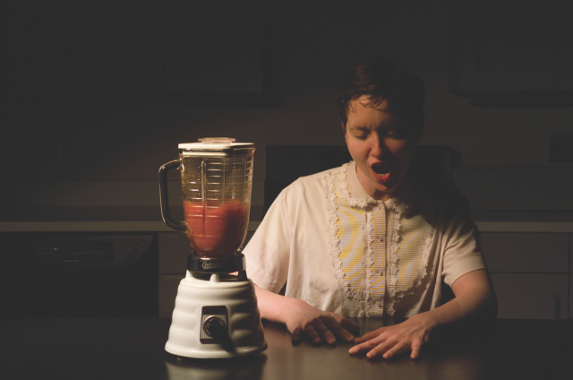
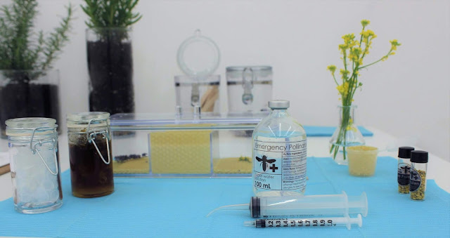

# Project 2: Affective Machine

Kelly Dobson [_Blendie_](https://web.archive.org/web/20221207010944/https://web.media.mit.edu/~monster/blendie/) (2003-2004)

- [affect](https://www.dictionary.com/browse/affect), from dictionary.com
- [affective computing](https://en.wikipedia.org/wiki/Affective_computing "Link"), from wikipedia.org
- [social robots](https://en.wikipedia.org/wiki/Social_robot), from wikipedia.org

## Description

This project asks you to engage with this rich intersection of feelings and machines (Human and Technological). 

The topics in this class have circled around questions of intelligence, responsiveness, expressiveness, meaningful behavior, and beliefs/feelings. What are the ways in which technologies can be seen to demonstrate these qualities? Or how do technologies engage with these qualities in our selves? It is about exploring reciprocal relationships between humans and machines?

For this project we want you to build an "Affective Machine". This could be a machine that demonstrates affect (outward expression of emotions), or acts upon us in an affective way (causing change in our emotions). You could approach this through ideas of (a) affective and social computing literature, (b) machine therapy, or even (c) healing machines.

This will require you to have a perspective: 
- What does it mean to have or demonstrate "feelings"?
- What does it mean to act on or upon "feelings"?
- How can a thing tend to our needs?
- How can we tend to a machine's needs? How can a machine ask for help?

## Requirements

You will be responsible for this as a complete sculpture. Use the envision board, some combination of sensors, actuators, displays, inputs/outputs. (BLE, laptop).

## Initial Ideation

For this assignment you are being asked to ideate and develop **three unique concepts** that explore the idea of Affective Machines. Exploring this intersection of feelings and machines, we are curious about machines the (a) act on feelings - changing them (ours/theirs), (b) express feelings - evoking them, or (c) are affected by feelings (ours/theirs/others).

Each concept reflects your take on a machine that evokes strong feeling or a strong feeling that is embodied in a machine. Each of your three concepts should be unique, thoughtfully considered, and demonstrate creative risk.

Document each concept in your digital sketchbook, include supporting sketches, imagery and text.

Minimum 1 page each (3 pages total), more is fine!

DUE Tuesday Week 7, submit pdf pages to canvas.

## Proposal
DUE End of Week 7

You will submit a two paragraph proposal for your idea addressing the following questions below. The first paragraph should describe how you are choosing to approach the costume or prop prompt and get us excited for the concept. The second paragraph will address the logistics of your project and how you will produce and document the result.

- Concept (1 paragraph)
  - Describe your approach to the prompt. What is your project? 
  - Is narrative an important element of your piece?
  - How will you present your object / document it?
  - What is the perspective that you are taking on the questions above?

- Process (1 paragraph)
  - What technical know-how will you need to make your piece? 
  - What do you need to learn how to do that you do not know how to do? 
  - What sensors/actuators will you use to make your piece? 
  - What fabrication techniques will you use? 
  - In what context does your project exist?
    - How will you document your project? 

This written description will be submitted online to Canvas by Friday 2/20 end of day.

## Deliverables

1. Machines + Feelings - 3 Concepts/Design Ideas
   - 3 pages of sketches, diagrams, and notes in your digital sketchbook (pdf)
2. Proposal: 
   - Written proposal submitted to Canvas and added to your digital sketchbook (pdf)
3. Final Project Submission:  
   - Add the following to your digital sketchbook and submit:
     - Written Project Description (update your written proposal once you are done with the project, this is your project description)
     - Images
     - Embedded Videos with links.
    - source code (as zip)
    - circuit diagrams
    - photographs and/video of finished piece. 
3. Critique: 
   - Be prepared to present your project for Critique in Week 10.
   
# References

## Affective Machines

_Sun Yuan and Peng Yu [Can't Help Myself](https://www.guggenheim.org/artwork/34812) (2016)_

### Affective and Social Computing Literature

- Rosalind Picard "Affective Computing" MIT Technical Report 1995 [https://vismod.media.mit.edu/pub/tech-reports/TR-321.pdf](https://vismod.media.mit.edu/pub/tech-reports/TR-321.pdf)
- Cynthia Breazeal. 2003. Emotion and sociable humanoid robots. _International Journal of Human-Computer Studies_ 59, 1: 119–155. [https://doi.org/10.1016/S1071-5819(03)00018-1](https://doi.org/10.1016/S1071-5819(03)00018-1)
### Affective Machines

- Flatcat [https://www.kickstarter.com/projects/bakiwi/flatcat](https://www.kickstarter.com/projects/bakiwi/flatcat)
- Paro therapeutic robot [http://www.parorobots.com/](http://www.parorobots.com/)
- Jibo [https://robotsguide.com/robots/jibo](https://robotsguide.com/robots/jibo) (2023)
    - Cynthia Brezeal's robot
- RUBI [https://rubi.ucsd.edu/](https://rubi.ucsd.edu/) (2001-2009)
- Diego San [https://www.hansonrobotics.com/diego-san/](https://www.hansonrobotics.com/diego-san/) (2013)
- M.Gannon Personable Robotics [REF]
    - [Mimus](https://atonaton.com/mimus) (2016)
    - [Manus](https://atonaton.com/manus) (2019)
    - [Other Natures](https://atonaton.com/other-natures) (2022)
    - [https://www.dezeen.com/2023/07/17/robots-madeline-gannon-ai-aitopia/](https://www.dezeen.com/2023/07/17/robots-madeline-gannon-ai-aitopia/)
    - [https://medium.com/google-empathy-lab/conversations-with-the-lab-madeline-gannon-b475543fe673](https://medium.com/google-empathy-lab/conversations-with-the-lab-madeline-gannon-b475543fe673)
- affectiva [https://www.affectiva.com/](https://www.affectiva.com/)
- Woebot [https://woebothealth.com/](https://woebothealth.com/)
- Voight-Kampff Test
    - fandom wiki [https://bladerunner.fandom.com/wiki/Voight-Kampff_test](https://bladerunner.fandom.com/wiki/Voight-Kampff_test)
    - Bladerunner excerpt, Voiggt-Kampf Test [https://www.youtube.com/watch?v=Umc9ezAyJv0](https://www.youtube.com/watch?v=Umc9ezAyJv0)

### Tragic Machines

#tragedy #pathos #tragicmachines #machines

- Sun Yuan and Peng Yu [Can't Help Myself](https://www.guggenheim.org/artwork/34812) (2016)
    - [https://www.youtube.com/watch?v=ZS4Bpr2BgnE](https://www.youtube.com/watch?v=ZS4Bpr2BgnE)
- Thijs Rikers
    - [Suicide Machine Sand](https://www.thijsrijkers.nl/suicide-machine-sand/) (2013)
    - [Suicide Machine Saw](https://www.thijsrijkers.nl/saw/) (2013)
    - N. Ingraham [Artist's 'suicide' machines are designed to slowly destroy themselves](https://www.theverge.com/2013/10/20/4855810/artists-suicide-machines-are-designed-to-slowly-destroy-themselves) (2013)

## Healing Machines

_Lisa Korpos, Interspecies Practice: Community Bee Clinic [http://www.lisakorpos.com/p/community-bee-clinic.html](http://www.lisakorpos.com/p/community-bee-clinic.html)_

#healing #machines #health #wellbeing

- Kellie Dobson
    - _Blendie_ (2003-04) [https://web.media.mit.edu/~monster/blendie/](https://web.archive.org/web/20221207010944/https://web.media.mit.edu/~monster/blendie/)
    - _Screambody_ (1998-04) [https://web.media.mit.edu/~monster/screambody/](https://web.archive.org/web/20221018010451/https://web.media.mit.edu/~monster/screambody/)
    - _Machine Therapy_ (2002-) [https://web.media.mit.edu/~monster/machinetherapy/](https://web.archive.org/web/20220528003047/https://web.media.mit.edu/~monster/machinetherapy/)
    - _Machine Therapy_ Dissertation (2007) [https://dspace.mit.edu/handle/1721.1/44329](https://dspace.mit.edu/handle/1721.1/44329)
    - Kelly E. (Kelly Elizabeth) Dobson. 2007. Machine therapy. Massachusetts Institute of Technology. Retrieved September 10, 2023 from [https://dspace.mit.edu/handle/1721.1/44329](https://dspace.mit.edu/handle/1721.1/44329)

Additional References: 
- Pratt et. al, _Robots and care of the ageing self: An emerging economy of loneliness_ [https://journals.sagepub.com/doi/full/10.1177/0308518X231172199](https://journals.sagepub.com/doi/full/10.1177/0308518X231172199) [#cognition](app://obsidian.md/index.html#cognition)

#healing #machines
- [Allison Kudla *Capacity For Urban Eden - Human Error* (2010)](http://allisonx.com/project/capacity-for-urban-eden-human-error/)

### Complete Healing Machines

- Kelly E. (Kelly Elizabeth) Dobson. 2007. Machine therapy. Massachusetts Institute of Technology. Retrieved September 10, 2023 from [https://dspace.mit.edu/handle/1721.1/44329](https://dspace.mit.edu/handle/1721.1/44329)

### Projects

- Healing Earth / civilization
    -  StudioThinkingHand [link](https://studiothinkinghand.com/works/)
        - What heals - imagining futures by remembering and connecting to non-human species; bringing to light “deep time”
        - Projects: [Deep Time](https://studiothinkinghand.com/works/deep-time.html), [Habitats](https://studiothinkinghand.com/works/habitats.html)
    - Lucy McCrae - [https://www.lucymcrae.net/home](https://www.lucymcrae.net/home)
        - What heals - machines/devices that prepare us for future
        - Projects - [compression cradle](https://www.lucymcrae.net/compression-cradle), [swallowable perfume](https://www.lucymcrae.net/swallowable-parfum) (nicely scented sweat) 
    - Tara Transitory [link](https://soundstudiesblog.com/2015/10/05/ritual-noise-and-the-cut-up-the-art-of-tara-transitory/)
        - What heals - noise machine performance that disrupts “the false narrative of unity pervasive in Western concepts of gender”
    - [Fairphone](https://www.fairphone.com/en/story/) - “The phone that cares for people and planet”;
        - What heals - responsible material sourcing, sustainable electronics
    - Creative Coding assignment to “take apart an old electronics device and repurpose/reconstruct it into a new form”
        - What heals - [questioning the digital](https://www.reddit.com/r/funny/comments/16vlkc/youre_not_a_real_hipster_until/)

- Healing Cancer / disease 
    - What heals? - minerals, magnetic fields, electric currents (tinfoil, masking tape, plastic beads, vials of chemicals from pharmacist, painted wood, christmas ornaments)
    - [https://www.pbs.org/video/pbs-emery-blagdon-and-his-healing-machine/](https://www.pbs.org/video/pbs-emery-blagdon-and-his-healing-machine/)
    - [https://spacesarchives.org/explore/search-the-online-collection/the-healing-machines/](https://spacesarchives.org/explore/search-the-online-collection/the-healing-machines/)

- Emery Blagdon and His Healing Machines (Nebraska sandhills artist) 

- Healing personal history x local culture 
    - What heals - light; creating; the process of transforming your own environment; the practice of creating community
    - Projects - [VJ quilt](https://gretch.in/Project-2), [VJ window](https://gretch.in/Project-1)

- Gretchen Larsen - [https://gretch.in/](https://gretch.in/)

- Machine Therapy - healing people and healing machines(?); healing human machine relationships
    - Kellie Dobson
        - What heals - interactions that embrace the experiential/phenomenological "side effects" of technology—(i.e. the noise, the vibration) that acknowledge both human and machine as embodied agents; 
        - Projects:
        - Blendie (2003-04) [https://web.media.mit.edu/~monster/blendie/](https://web.media.mit.edu/~monster/blendie/)
            - what heals: cathartic expression, embodied connection with machine
        - Screambody (1998-04) [https://web.media.mit.edu/~monster/screambody/](https://web.media.mit.edu/~monster/screambody/)
            - what heals: making space for cathartic expression;
        - Machine Therapy (2002-) [https://web.media.mit.edu/~monster/machinetherapy/](https://web.media.mit.edu/~monster/machinetherapy/)

- Healing loss
    - What heals: sustained fictional immersion; a bubble outside of time; self-deception?
    - Joshua Barbeau's Jessica Project (2021) [https://www.sfchronicle.com/projects/2021/jessica-simulation-artificial-intelligence/](https://www.sfchronicle.com/projects/2021/jessica-simulation-artificial-intelligence/)
        - what heals: de-stigmatization, lessening the pain of loss; dwelling in the memory;
        - Project December [https://projectdecember.net/](https://projectdecember.net/)
        - [https://projectdecember.net/terminalSSL/](https://projectdecember.net/terminalSSL/)
    - Eugena Kudya's replication of her friend Roman Mazurenko with Luka (2017) [https://www.theverge.com/a/luka-artificial-intelligence-memorial-roman-mazurenko-bot](https://www.theverge.com/a/luka-artificial-intelligence-memorial-roman-mazurenko-bot) (now [replika.ai](https://replika.ai/))
        - what heals: dwelling in the material traces, "data" of the lost one; immersion;
    - Prof. Twomey's Megahal Grandmommy (2005) [https://roberttwomey.com/megahal-grandmommy/](https://roberttwomey.com/megahal-grandmommy/)
        - what heals: rehearsal against loss; therapeutic sharing

- Healing personal and environmental (and technological) health

- What heals: prescriptions for environmental aches and pains; fostering beneficial mutualism (Human Nature Technology triad);
- Natalie Jeremijenko

- xClinic - Environmental Health Clinic [http://www.carbonarts.org/people/natalie-jeremjenko/](http://www.carbonarts.org/people/natalie-jeremjenko/)
  - AgBags - Declaration of Interdependence (2013) [https://www.gardnermuseum.org/calendar/presence-of-plants-facade](https://www.gardnermuseum.org/calendar/presence-of-plants-facade)
  - Amphibious Architecture - What does the derwent want?: [http://www.carbonarts.org/projects/amphibious-architecture-what-does-the-derwent-want/](http://www.carbonarts.org/projects/amphibious-architecture-what-does-the-derwent-want/)
    - what heals: decentering the human; focused attention on aquatic ecosystems; highlighting our interdependence.
  - Melbourne Mussel Choir: [http://www.carbonarts.org/projects/melbourne-mussel-choir/](http://www.carbonarts.org/projects/melbourne-mussel-choir/)
    - what heals: decentering the human; recognizing others (animals, plants) have needs, wants, desires; recognizing nature has optimized forces/processes for environmental remediation
  - BIT Suicide Box: [https://archive.transmediale.de/content/suicide-box](https://archive.transmediale.de/content/suicide-box)
- Joseph Beuys
  - 7000 Oaks [https://diaart.org/visit/visit-our-locations-sites/joseph-beuys-7000-oaks/](https://diaart.org/visit/visit-our-locations-sites/joseph-beuys-7000-oaks/)
  - [https://philbartonartist.c4cp.net/wp-content/uploads/sites/3/2020/10/200130-Research-Paper-Submitted-1-Mb-Copy.pdf](https://philbartonartist.c4cp.net/wp-content/uploads/sites/3/2020/10/200130-Research-Paper-Submitted-1-Mb-Copy.pdf)
  - More on Beuys [https://www.theguardian.com/artanddesign/2016/jan/30/fat-felt-fall-earth-making-and-myths-joseph-beuys](https://www.theguardian.com/artanddesign/2016/jan/30/fat-felt-fall-earth-making-and-myths-joseph-beuys)

- Lisa Korpos, Interspecies Practice: Community Bee Clinic [http://www.lisakorpos.com/p/community-bee-clinic.html](http://www.lisakorpos.com/p/community-bee-clinic.html)

## Responsive Environments

[Examples in Google Slides](https://docs.google.com/presentation/d/1Dpbd6Rjt3HfeNwaKjkH7iWIZj7EBL3AVDoq4lGyBsWo/edit?usp=drive_link)