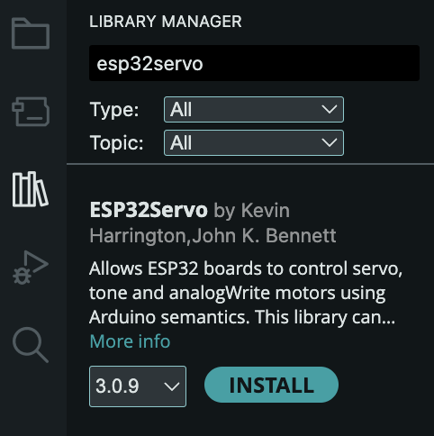
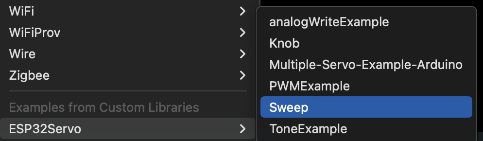
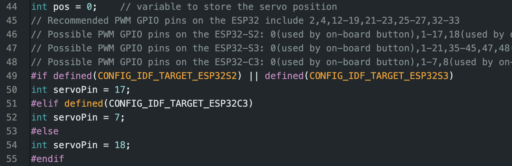
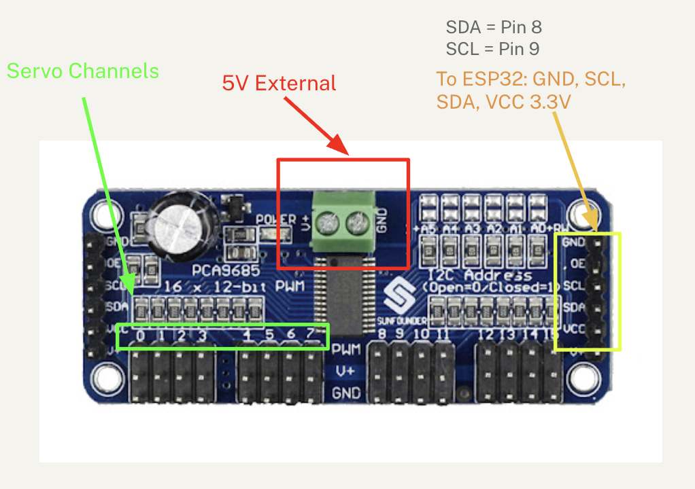

# Dev Board Actuators
Making things move. 

- [Servo Sweep](#servo-sweep)
- [Servo Knob](#servo-knob)
- [DC Motors](#dc-motors)
- [PCA9685 12bit Servo Driver](#pca9685-12bit-servo-driver) - multiple servos at once.

## Servo Motor
Rotational motion 0-180 degrees.

Another use of Pulse Width Modulation is driving the position of a servo motor. 

### Servo Sweep

1. Install the **ESP32Servo** library: 
   - **Tools** -> **Manage Libraries**: 
     -  
   - Search for **ESP32Servo**. Click **Install**:
    - 
2. Under **Examples** -> **ESP32Servo**, select the **Sweep** example: 
   - 
   - Make sure that your servo is connected to the pins used in the example code. Or change the pins in the code to match your setup.
   - 
4. Wire up the servo:
   - BLACK/BROWN -> Ground
   - RED/YELLOW -> +5V
   - ORANGE -> your `servoPin`.
3. Compile and run the example.

### Servo Knob

We are going to use the potentiometer knob as an input device. You can think of a knob as a kind of simple "sensor" to drive the servo motion.

- Under **Examples** -> **ESP32Servo**, select the **Knob** example: 
  - 


- Reading the schematic.
- Use the servo to control two knobs. 

## DC Motors
Continous forward/backward motion controlled with PWM outputs. Including geared DC motors, which are a special instance of the above with slower rotation rate. 

### Wiring

From the ESP32 to the Motor Shield, connect: 

GND -> GND
5V -> 5V
3.3V -> 3.3V
pin 45 -> pin 45 (MTR1A)
pin 46 -> pin 46 (MTR1B)

Connect the two wires of your DC motor to M1 screw terminal. 
Connect external power to 4.5-11V in.

### Code
```C++
// Using the DRV8835DSSR driver on the Envision Motor Shield
// define the pins for IN-IN mode (MTR1A and MTR1B)
// rtwomey@ucsd.edu

const int in1Pin = 45; 
const int in2Pin = 46;

// PWM Settings
const int freq = 10000;  
const int resolution = 8; // 0-255 range

void setup() {
  // Attach both pins to the LEDC PWM peripheral
  ledcAttach(in1Pin, freq, resolution);
  ledcAttach(in2Pin, freq, resolution);
}

void loop() {
  // Move Forward at 75% speed
  // IN1 gets PWM, IN2 stays LOW
  ledcWrite(in1Pin, 192); 
  ledcWrite(in2Pin, 0);
  delay(4000);

  // Brake (Locks the motor)
  ledcWrite(in1Pin, 255);
  ledcWrite(in2Pin, 255);
  delay(2000);

  // Move Backward at 100% speed
  // IN1 stays LOW, IN2 gets PWM
  ledcWrite(in1Pin, 0);
  ledcWrite(in2Pin, 255);
  delay(4000);
  
  // Coast (Let the motor spin down freely)
  ledcWrite(in1Pin, 0);
  ledcWrite(in2Pin, 0);
  delay(2000);
}
```

Download: [esp32_dcmotor.zip](assets/esp32_dcmotor.zip)

## PCA9685 12bit Servo Driver

This is a 16 channnel servo driver, allowing you to control up to 16 servos with a single board. You also can power this board servos with an external power supply, so they work more reliably than they would powering through the in-built 5v supply or your USB input.

This chip, the PCA9685, is controlled over an I2C connection controlled using the [Wire](https://docs.arduino.cc/language-reference/en/functions/communication/wire/) library.




```C++
#include <Wire.h>
#include <Adafruit_PWMServoDriver.h>


// Default address 0x40
Adafruit_PWMServoDriver pwm = Adafruit_PWMServoDriver();


// Servo pulse length specifics (calibrate as needed)
#define SERVOMIN 150  // Minimum pulse length count (out of 4096)
#define SERVOMAX 600  // Maximum pulse length count (out of 4096)


void setup() {
  Serial.begin(115200);
    // SDA=8, SCL=9 for most S3 Mini boards
  Wire.begin(8, 9);
  Serial.println("PCA9685 Servo Test");
  pwm.begin();
  pwm.setPWMFreq(60);  // Analog servos run at ~50 Hz
  delay(10);
}


void loop() {
  // Move servo 0 to 0 degrees
  setServoAngle(0, 0);
  delay(1000);
 
  // Move servo 0 to 180 degrees
  setServoAngle(0, 180);
  delay(1000);
}


// Helper function to map angle (0-180) to PWM pulses
void setServoAngle(uint8_t n, int angle) {
  int pulse = map(angle, 0, 180, SERVOMIN, SERVOMAX);
  pwm.setPWM(n, 0, pulse);
}
```

Download: [esp32_pca9685.zip](assets/esp32_pca9685.zip)


## Solenoid
Push (or pull) linear potion. Digital (on/off).
[TK]

## Stepper Motor
Very precise rotational motion (200 steps/rotation, typically), controlled with digital outputs.
[TK]

# References
[TK]

### ESP32-ESP32S Analog Write

#### Easing


[Servo Easing](https://github.com/Dlloydev/ESP32-ESP32S2-AnalogWrite?tab=readme-ov-file#servo-easing)


