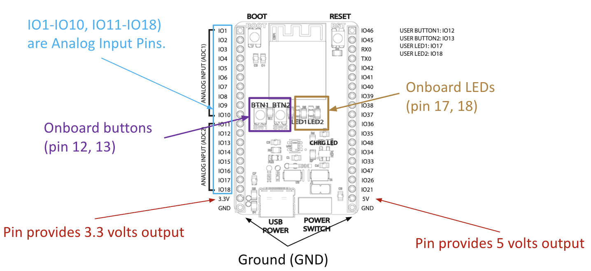
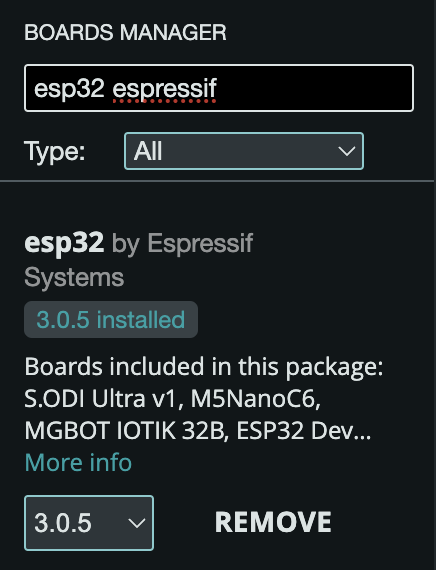
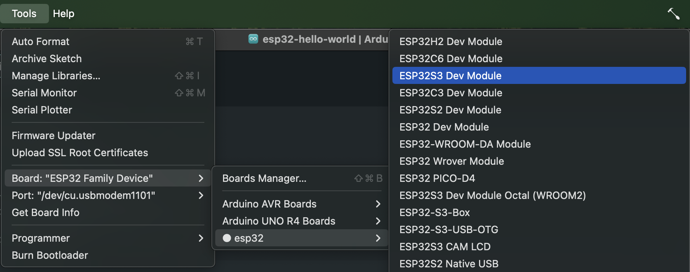
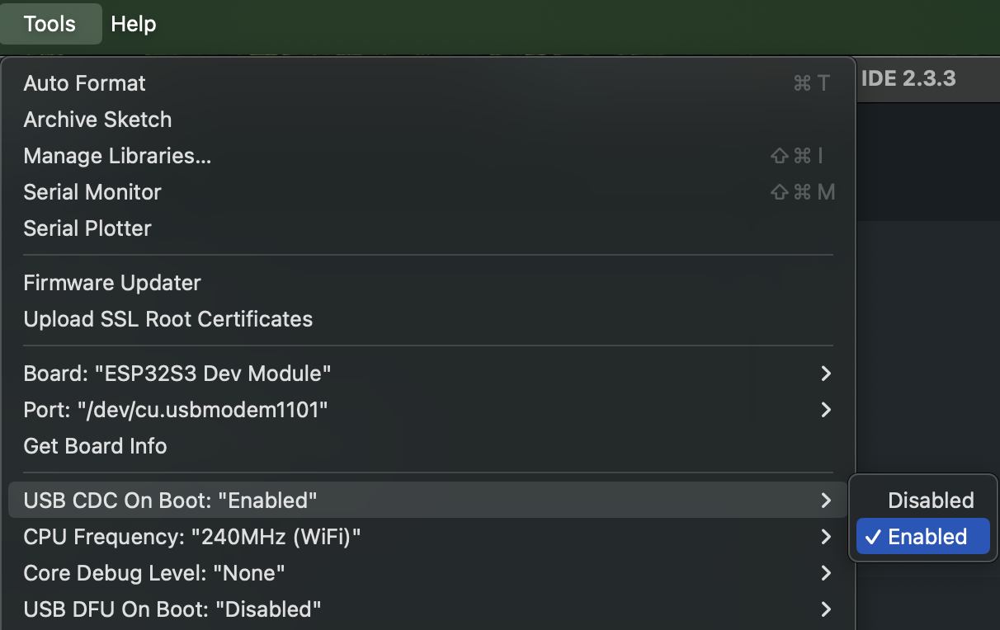
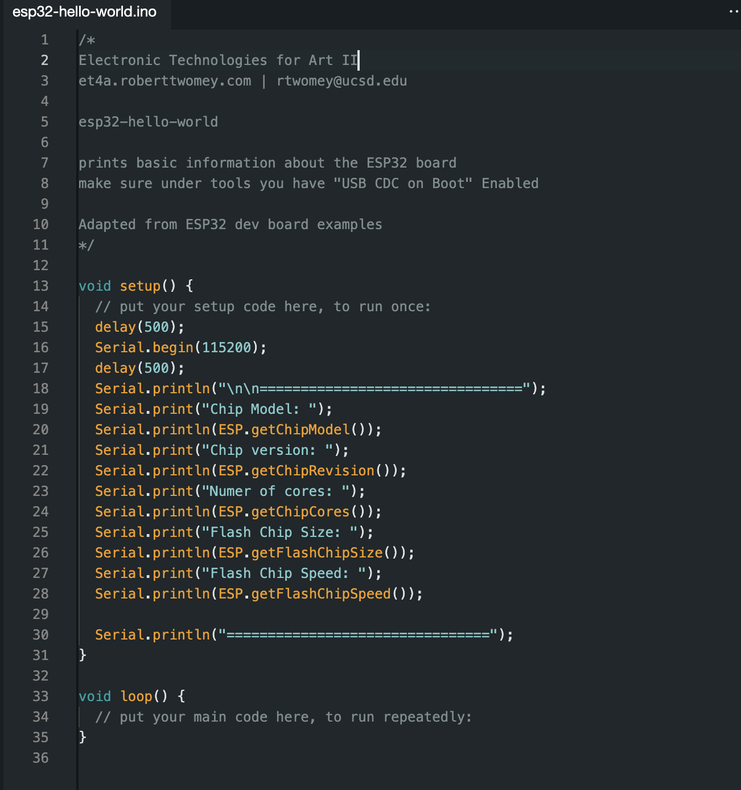
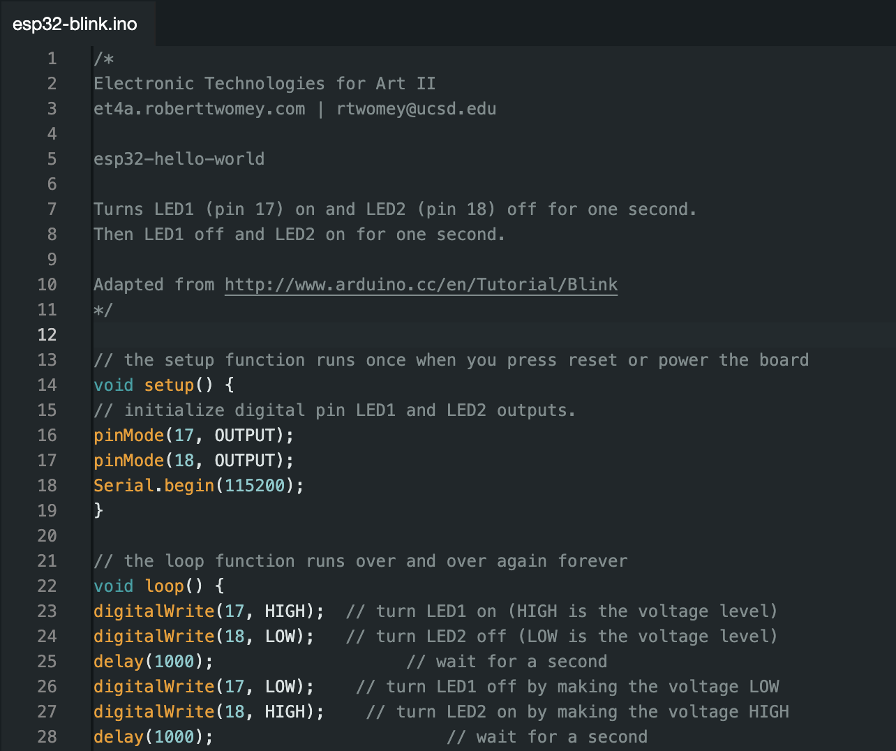
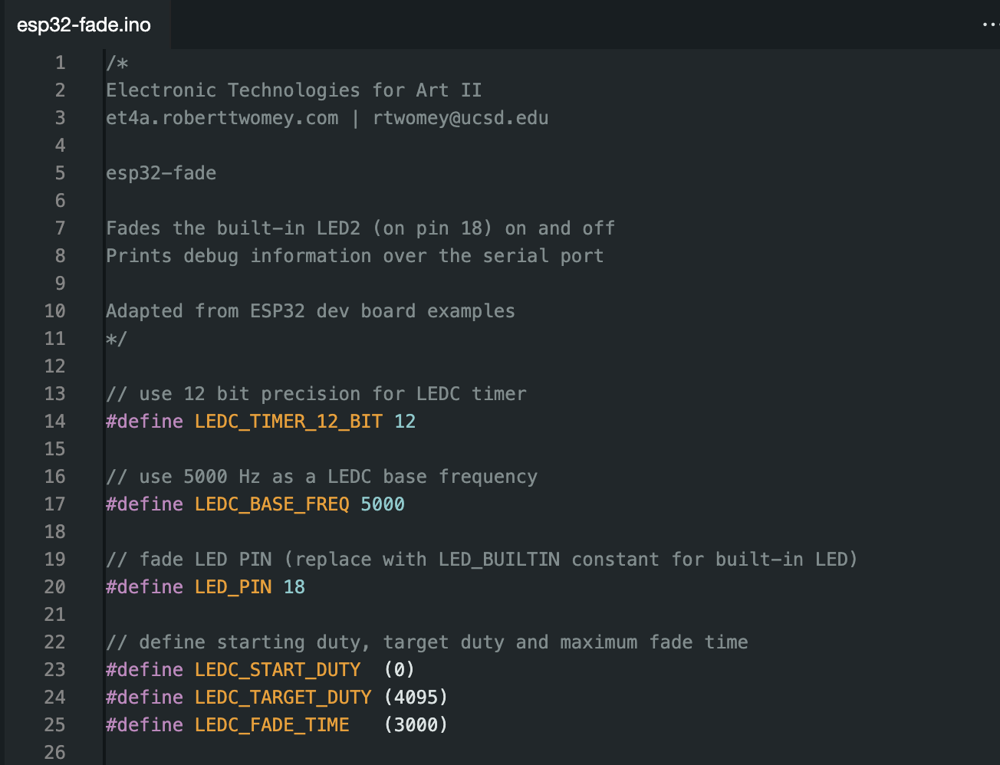

# Getting Started with the Dev Board

This tutorial walks you through initial getting started activities to set up your dev board. 

## 1. Software Setup
Install the [Arduino IDE](https://www.arduino.cc/en/software) on your laptop.

Download link: [https://www.arduino.cc/en/software](https://www.arduino.cc/en/software)

## 2. Setup and Configure the Dev Board

1. In **Tools -> Board: -> Boards Manager** install the esp32 board definition from Espressif:
   -  
2. Connect your board via USB-C cable.
3. In Arduino, under **Tools -> Board:** select **ESP32S3 Dev Module**
   - 
4. Under **Tools** select **USB CDC on Boot:** to **enabled** (this enables the serial monitor and serial port)
   - 

## 4. Upload your first program
Hello World

[esp32-hello-world.zip](../assets/esp32-hello-world.zip)

Prints basic info about the board to the serial monitor.

## 5. Blink

[esp32-blink.zip](../assets/esp32-blink.zip)

Turns LED1 (pin 17) on and LED2 (pin 18) off for one second. 
Then LED1 off and LED2 on for one second. 

## 6. Optional: Fade

[esp32-fade.zip](../assets/esp32-fade.zip)

Fades LED2 (pin 18) on and off using `analogWrite()`.

# References
[TK]