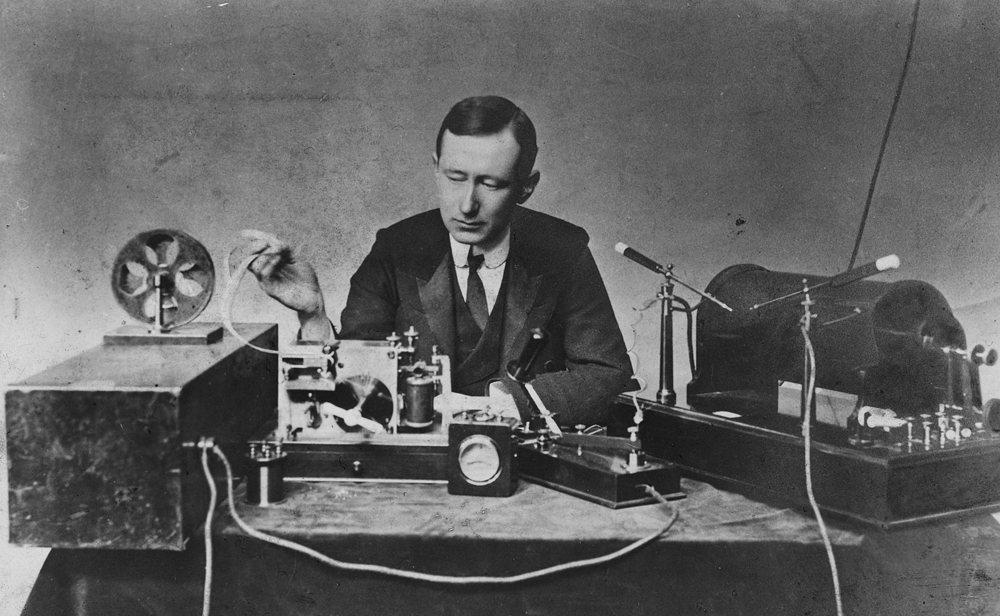
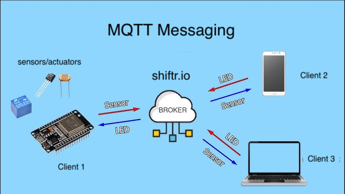
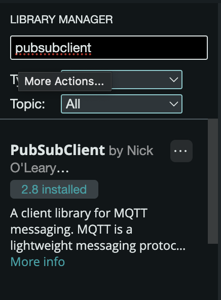
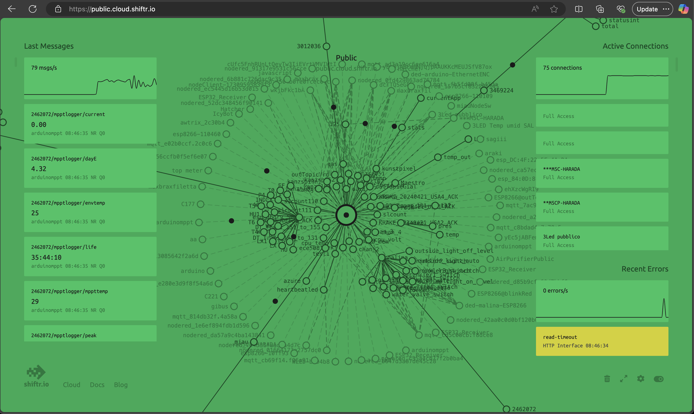

# Week 6 - Networked Sensors / Actuators



_Electrical engineer/inventor Guglielmo Marconi with the spark-gap transmitter (right) and coherer receiver (left) he used in some of his first long distance radiotelegraphy transmissions during the 1890s._ ([source](https://en.wikipedia.org/wiki/Guglielmo_Marconi))

## Agenda

<!-- - [Artist of the Day](#artist-of-the-day) -->
- Discuss and Review Remote Control / BLE
- [Intro to MQTT](#introduction-to-mqtt)
- Hands-On
  - [MQTT Hello World](#mqtt-hello-world)
  - [MQTT Relay](#mqtt-relay)
  - [MQTT Servo](#mqtt-servo)
  - [Networked Experiments](#networked-experiments)
- ~ break ~ 
- Discuss: 1999 A.D. 
- [Homework](#homework)

## Introduction to MQTT

Sensors: BLE and MQTT ([google slides](https://docs.google.com/presentation/d/10c6eV6ADTNnGe8YiQ8qB13O7NO8n960NmWG6CGB94O4/edit?usp=sharing))

- BLE... What was that?
- What is MQTT?
- How is MQTT different from BLE? 

We are exploring shiftr.io as our mqtt broker. You can view a live visualization of their public broker here (brace yourself): [https://www.shiftr.io/try/](https://www.shiftr.io/try/)

There are many other brokers available, in addition to ones you can run on your own devices (for instance [Moqsuitto MQTT on Raspberry Pi](https://randomnerdtutorials.com/how-to-install-mosquitto-broker-on-raspberry-pi/)).

## MQTT Examples

- [MQTT Hello World](#mqtt-hello-world)
- [MQTT Relay](#mqtt-relay)
- [MQTT Servo](#mqtt-servo)

We will run these examples on the ESP32 devboard, connected to an MQTT broker on shiftr.io. 



When you upload the arduino code below, you wil specify the "topic" it is publishing/subscribing to. You will want to name this topic to correspond to your device. 

For instance, by default the example will say `/smartenv/devboard1`. We don't want 15 of those boards with the same name, so try renaming it to something individualized (f.ex. `/smartenv/robertservo`).

### MQTT Hello World

Source code link: [mqtt-stored-credentials.zip](../assets/mqtt-stored-credentials.zip)

#### Setup Instructions

Install the PubSubClient with the Arduino **Tools->Manage Libraries** 



1. Unzip this sketch and load it in arduino. 
2. Edit the sketch to enter your UCSD username and password if on campus (or network SSID and password if off campus). Uncomment the line 76 `saveWifiCredentials()` and add your UCSD username and password.
3. Compile and upload the program to your ESP board.
4. When you run this program once, it will store your credentials (login info) in the NVM (non-volatile memory a.k.a. permanent storage) on the ESP.
4. Now go back and delete the line about saveWifiCredentials(), so your info isn't stored in your code.
5. You will now be able to use the `loadWifiCredentials()` function any other time you need to login with username and password. 
6. If you need to use this board at home / on a different network, repeat the process from step 2 and enter your new network name and password.

#### Description 
This program logs into your wifi, connects to an MQTT server at shiftr.io ([https://public.cloud.shiftr.io/](https://public.cloud.shiftr.io/)), and then publishes info on a **topic**. It also subscribes to that topic, listening for information. 

In the serial port you should be able to see debug information when it first connects to the wifi, connects to the MQTT server, and when it receives any updates on the topic.

#### Test it Out
To test out the MQTT connectivity, we can use a simple p5 sketch [mqttPublisher](https://editor.p5js.org/robert.twomey/full/efvS8DVIO) to read or write info from the topic. ([edit link](https://editor.p5js.org/robert.twomey/sketches/efvS8DVIO))

By default, the __topic__ for your device is `/smartenv/devboard1`, defined both in the Arduino code and the p5 sketch. 

**NOTE**: You will want to change this topic to give your own devboard a name, so f.ex. `/smartenv/robert1/`. For now, let's keep the `/smartenv/` base the same for everyone, so we can see all of our messages in the shiftr online graph. **You will need to change the topic in both the arduino code and the p5 sketch for thit to work.**

Change the topics (line 166, 168) to reflect your device name. So go from: 

```C
      if (digitalRead(SW1)) {
        client.publish("/smartenv/devboard1/sw1", "1");
      } else {
        client.publish("/smartenv/devboard1/sw1", "0");
      }
```

to

```C
      if (digitalRead(SW1)) {
        client.publish("/smartenv/robert1/sw1", "1");
      } else {
        client.publish("/smartenv/robert1/sw1", "0");
      }
```

#### See What's Happening



We can also use the public shiftr.io interface to view all of the MQTT messages being sent through their server. 

Open [https://public.cloud.shiftr.io/](https://public.cloud.shiftr.io/) and look for the `/smartenv/` topic, so for instance `/smartenv/devboard1` as the base code is configured.

#### Send Messages

Our source code built in a way to control LED2 (pin 18)using the topic address `/smartenv/devboard1/`: 
- Sending `on` to this topic (from the p5 sketch) turns the orange light // LED2
  -  
- Sending `off` turns off LED2
  - 

### MQTT Servo

Adapt the source code to move a servo motor in addition to controlling the LED.

__Topic__: `/smartenv/devboard1` (choose the correct topic name for your device)

__Messages__

Add code to control the movement. Assuming the servo is attached to pin D0, you want to check for data such as:
- `left` to move all the way to the left
- `right` to move all the way to the right
- `move 90` to move some number of degrees. you can parse this message and decode the "move" and the number each separately.
  - 

__Test It__
Again, we can use the p5 [mqttPublisher](https://editor.p5js.org/robert.twomey/full/efvS8DVIO) to test it out. ([edit link](https://editor.p5js.org/robert.twomey/sketches/efvS8DVIO))


### MQTT Relay

Adapt the source code to control a relay instead of the built-in LED.

__Topic__: `/smartenv/devboard1` 

(NOTE: you will want to change this topic to give your own devboard a name, so f.ex. `/smartenv/robert1/`)

__Messages__

Relay control: 
- (attached to pin D0)
- `on` turns relay on
  -  
- `off` turns relay off
  - 

__Test It__
Again, we can use the p5 [mqttPublisher](https://editor.p5js.org/robert.twomey/full/efvS8DVIO) to test it out. ([edit link](https://editor.p5js.org/robert.twomey/sketches/efvS8DVIO))

### Networked Experiments

Let's all wire up some different sensors/actuators and assign them different MQTT topics. 

Play around with interoperability! (E.A.T)

## Homework
- Complete [HW3 Remote Control](https://canvas.ucsd.edu/courses/60624/assignments/870599) (DUE Friday 11/8 11:59pm)
- Complete [Reading and Discussion: Responsive Architecture and Affective Computing](https://canvas.ucsd.edu/courses/60624/discussion_topics/823520) (DUE Wednesday 11/13 9am for in class discussion)
- Complete [Digital Sketchbook - Midterm Checkin](https://canvas.ucsd.edu/courses/60624/assignments/871960) (DUE Wednesday 11/13 11:59pm)

## References
- MQTT "the standard for IoT messaging" [https://mqtt.org/](https://mqtt.org/) 
- Mosquitto DIY cloud hosting with Digital Ocean [https://randomnerdtutorials.com/cloud-mqtt-mosquitto-broker-access-anywhere-digital-ocean/](https://randomnerdtutorials.com/cloud-mqtt-mosquitto-broker-access-anywhere-digital-ocean/)

### Additional Code Examples
- [mqtt-stored-credentials.zip](../assets/mqtt-stored-credentials.zip) store your credentials one time, then retrieve them from NVM