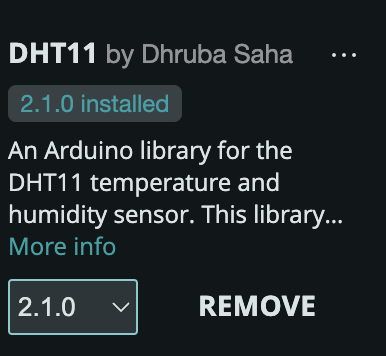
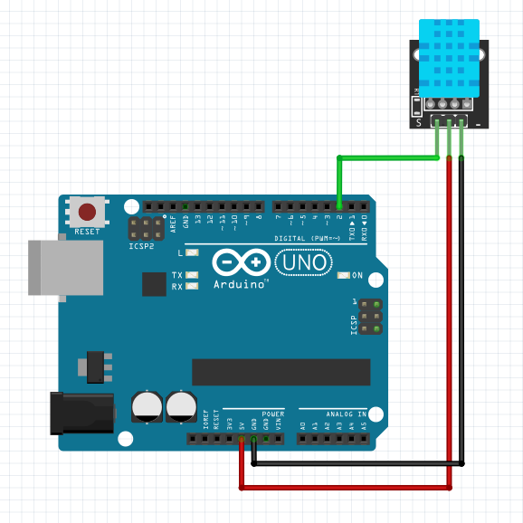
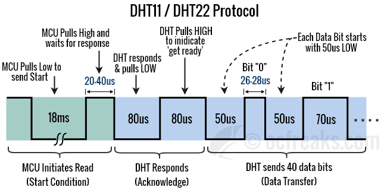

# Week 3 - Sensors and Sensations

## Agenda

- Look at "Making Things Move" 
- [Artist(s) of the Day](#artists-of-the-day)
- Tutorial: Basic Sensing and Analog Input
  - [Digital Input](#digital-input)
  - [Analog input](#analog-input)
  - [Analog Read Serial](#analog-read-serial)
  - [Photoresistor Part 1](#photoresistor-part-1) light sensor
- Advanced Sensors
  - [Thermistors](#thermistors) (resistive)
  - [Temperature Humidity sensor](#temperature-sensor) (active)
  - [Ultrasonic Rangefinder](#ultrasonic-rangefinder)
- Discuss: Beliefs/Desires
- Project 1 Check-In and Work Time
- [Homework](#homework)

## Artist(s) of the Day 

---


Amy Youngs

- [Rearming the Spineless Apuntia](https://hypernatural.com/portfolio/rearming-the-spineless-opuntia/)
- rest of portfolio: [https://hypernatural.com/art/](https://hypernatural.com/art/)

---


Inmi Lee

- [I love you (Love In The Absence of Intelligence)](https://www.inmilee.com/love.html) 2011.

---


Lillian Schwartz [Pixillation](https://www.thehenryford.org/collections-and-research/digital-collections/artifact/519817#slide=gs-566565)

> To make her first film, the four-minute “Pixillation” (1970), for example — a project that took two months — she fed punch cards into an IBM 7094 mainframe computer to produce 85 black-and-white frames on magnetic tape.


[Proxima Centari](https://www.thehenryford.org/collections-and-research/digital-collections/artifact/537306) 1968-1969

> In 1968, her kinetic sculpture “Proxima Centauri” appeared in a landmark show at the Museum of Modern Art in New York titled “[The Machine as Seen at the End of the Mechanical Age](https://www.moma.org/calendar/exhibitions/2776),” curated by Pontus Hulten. The piece included discarded street lamp domes and the motor from a sewing machine that Ms. Schwartz had inherited from her mother.

> [The Times later described](https://www.nytimes.com/1971/10/25/archives/an-artist-makes-house-calls-to-treat-her-ailing-works.html?searchResultPosition=11) a version of the piece, which was in her home, as “a big black cabinet with a plastic dome inserted in the top, with a color sequence running beneath the dome’s surface. When anyone stands close to the cabinet, the dome starts to withdraw and slowly drops out of sight.”

(from [nytimes bio + obit](https://www.nytimes.com/2024/10/14/technology/lillian-schwartz-dead.html))

> Lillian Schwartz is a pioneer of computer-generated art. From 1969-2002, she was a "resident visitor" at Bell Laboratories, producing groundbreaking films, videos, and multimedia works. The Schwartz Collection spans Lillian's childhood into her late career, documenting an expansive mindset, mastery over traditional and experimental mediums alike--and above all--an ability to create inspirational connections between science, art, and technology.

(from [The Henry Ford](https://www.thehenryford.org/collections-and-research/digital-collections/artifact/519817#slide=gs-566565))

## Basic Sensing

(Digital and Analog Input)

### Digital Input

[TK PIR sensor]

### Analog Input


[https://www.arduino.cc/en/Tutorial/BuiltInExamples/AnalogInput](https://www.arduino.cc/en/Tutorial/BuiltInExamples/AnalogInput)

- Demo: 
  - Talk about Voltage, Current, and Resistance (Ohm's Law)
  - Talk about using a multimeter. 
  - Look at how a potentiometer (as voltage divider) changes voltages
  - Show how a changing voltage corresponds to an `analogRead()`

### Analog Read Serial


[https://docs.arduino.cc/built-in-examples/basics/AnalogReadSerial](https://docs.arduino.cc/built-in-examples/basics/AnalogReadSerial)

- Keep the potentiometer hooked up into Analog Input 0 (A0) on the arduino. 
- Load the AnalogReadSerial sketch (Examples->01.Basics->AnalogReadSerial) to the arduino. 
- Open the serial monitor:
  - 
  - Look at how moving the potentiometer changes the value of analogRead(). 
- Activity: 
  - Use [`map()`](https://www.arduino.cc/reference/en/language/functions/math/map/) to scale those analog values to 0-255, and use that to fade a jumbo LED (`analogWrite()`)
- We can use `serial.write()` to communicate with p5, or processing, or maxMSP or any other program that can read from a serial port.

### Photoresistor Part 1


[https://www.arduino.cc/en/Tutorial/BuiltInExamples/AnalogInput](https://www.arduino.cc/en/Tutorial/BuiltInExamples/AnalogInput)

- Use a multimeter to see how the resistance changes with the photoresistor. 
  - (this does not need a circuit. connect the red lead to one side of the photoresister, and the black lead to the other)
- We can put a photoresistor in series with a resistor to make a voltage divider. This is similar to how a potentiometer works. As the resistance of the photoresistor changes (the light changes), the output voltage will change.
- Hook up the circuit in the picture above with a resistor, photoresistor, and wires to ground, 5V, and A0.
- Use AnalogReadSerial from the section above, and use the serial port monitor to see what the range of output voltages is.
- Activity: Use the photoresistor to control the servo from last class, in place of the potentiometer
  1. Use the serial port to debug the range of analog values coming in from the photo-resistor/resistor voltage divider.

## Advanced Sensors

### Thermistors

LAST TIME WE DID THIS!


- Good adafruit tutorial: [https://learn.adafruit.com/thermistor/using-a-thermistor](https://learn.adafruit.com/thermistor/using-a-thermistor)
  - including more about voltage dividers: [https://learn.adafruit.com/thermistor/using-a-thermistor#analog-voltage-reading-method-2917724](https://learn.adafruit.com/thermistor/using-a-thermistor#analog-voltage-reading-method-2917724)
- Demo: How a thermistor changes resistance with changes in temperature

### Temperature and Humidity

1) Install DHT11 Library: **Tools** -> **Manage Libraries** -> search for DHT11 by Dhruba Saha. 
   - 
2) Try Examples -> DHT11 -> Read Temperature
3) Wire up circuit (confirm Elegoo DHT11 pinouts before powering on, DATA/OUT should go to Arduino D2)

   - 

DHT11 Protocol 
from ([https://www.ocfreaks.com/basics-interfacing-dht11-dht22-humidity-temperature-sensor-mcu/](https://www.ocfreaks.com/basics-interfacing-dht11-dht22-humidity-temperature-sensor-mcu/))

### Temperature Sensor

NOT IN ELEGOO KIT


(image from [Adafruit](https://learn.adafruit.com/tmp36-temperature-sensor/using-a-temp-sensor))

- The [TMP 36GZ](http://www.us.diigiit.com/tmp36gz-temperature-sensor) is a temperature sensor.
- This is an active sensor, meaning we provide power to ground and 5V, and it outputs a voltage proportional to temperature.
  - Looking at the [datasheet](http://www.us.diigiit.com/download/TMP35-36-37.pdf), we see it is 10mV/degree Celsius. That means we can use the output voltage (read by analog in) to figure out what the temperature is.
- To convert from AnalogRead value to milli-volts: __Voltage at pin in milliVolts = (reading from ADC) * (5000/1024)__
- To convert from milliVolts to degree celsius: __Centigrade temperature = [(analog voltage in mV) - 500] / 10__
- Activity: 
  - Use AnalogReadSerial to figure out what the current temperature in the room is in Celsius.
  - Modify your code to convert Celsius to fahrenheit. 
  - Explore the dynamic behavior: how quickly does it change in response to breathing on it? In response to touching it? Can you get the temperature to go up, or go down?

### Ultrasonic Rangefinder


- Install the HCSR04 library (**Tools->Manage Libraries->Search** for "HCSR04")
  - 
- Try the **File->Examples->HCSR04->simple** example. 

**NOTE❗❗**: Change the line that initializes the sensor to use pins 12 and 11 from: 
```c
UltraSonicDistanceSensor distanceSensor(13, 12);  // Initialize sensor that uses digital pins 13 and 12.
```
to
```c
UltraSonicDistanceSensor distanceSensor(12, 11);  // Initialize sensor that uses digital pins 12 and 11.
``` 
(shown in the diagram above)

HC SR04 Timing Diagram 

## Beliefs and Desires

- Discuss McCarthy reading from one weeks ago.

## Homework
- Finish [Project 1](../projects/project1.md) Biomimicry (DUE 10/23 for in class critique)
- Reading + Discussion: [Experiments in Art And Technology](https://canvas.ucsd.edu/courses/60624/discussion_topics/823521) (DUE 10/23 for discussion)

## References
- ELEGOO Super Starter Kit pdf files: [https://drive.google.com/file/d/1SO3fE0uGj5zWoRDyEcqw6EWSEa3kLStb/view](https://drive.google.com/file/d/1SO3fE0uGj5zWoRDyEcqw6EWSEa3kLStb/view)