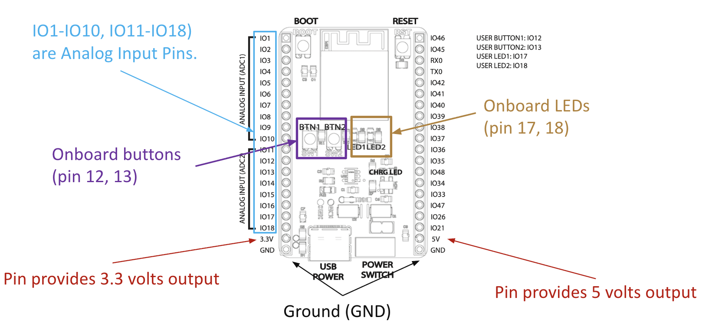
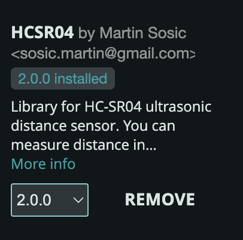
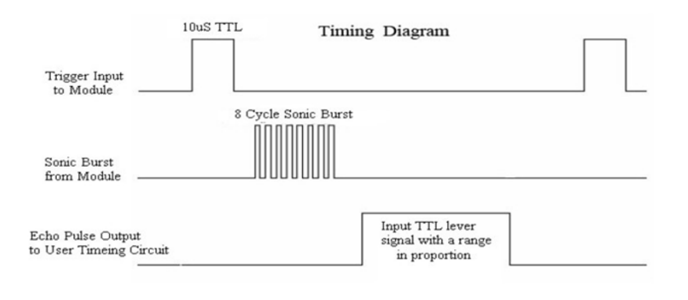

# Week 3 - Sensors and Sensations

## Agenda

- Look at "Making Things Move" 
- [Artist(s) of the Day](#artists-of-the-day)
- Tutorial: Basic Sensing and Analog Input
  - [Digital Input](#digital-input)
  - [Analog Input](#analog-input)
  <!--- [Analog Read Serial](#analog-read-serial)-->
  - [Photoresistor Part 1](#photoresistor-part-1) light sensor
- Advanced Sensors
  - [Thermistors](#thermistors) (resistive)
  - [Ultrasonic Rangefinder](#ultrasonic-rangefinder)
  - [PIR](#pir)
- Discuss: Beliefs/Desires
- Project 1 Check-In and Work Time
- [Homework](#homework)

## Artist(s) of the Day 

---


Amy Youngs

- [Rearming the Spineless Apuntia](https://hypernatural.com/portfolio/rearming-the-spineless-opuntia/)
- rest of portfolio: [https://hypernatural.com/art/](https://hypernatural.com/art/)

---


Inmi Lee

- [I love you (Love In The Absence of Intelligence)](https://www.inmilee.com/love.html) 2011.

---


Lillian Schwartz [Pixillation](https://www.thehenryford.org/collections-and-research/digital-collections/artifact/519817#slide=gs-566565)

> To make her first film, the four-minute “Pixillation” (1970), for example — a project that took two months — she fed punch cards into an IBM 7094 mainframe computer to produce 85 black-and-white frames on magnetic tape.


[Proxima Centari](https://www.thehenryford.org/collections-and-research/digital-collections/artifact/537306) 1968-1969

> In 1968, her kinetic sculpture “Proxima Centauri” appeared in a landmark show at the Museum of Modern Art in New York titled “[The Machine as Seen at the End of the Mechanical Age](https://www.moma.org/calendar/exhibitions/2776),” curated by Pontus Hulten. The piece included discarded street lamp domes and the motor from a sewing machine that Ms. Schwartz had inherited from her mother.

> [The Times later described](https://www.nytimes.com/1971/10/25/archives/an-artist-makes-house-calls-to-treat-her-ailing-works.html?searchResultPosition=11) a version of the piece, which was in her home, as “a big black cabinet with a plastic dome inserted in the top, with a color sequence running beneath the dome’s surface. When anyone stands close to the cabinet, the dome starts to withdraw and slowly drops out of sight.”

(from [nytimes bio + obit](https://www.nytimes.com/2024/10/14/technology/lillian-schwartz-dead.html))

> Lillian Schwartz is a pioneer of computer-generated art. From 1969-2002, she was a "resident visitor" at Bell Laboratories, producing groundbreaking films, videos, and multimedia works. The Schwartz Collection spans Lillian's childhood into her late career, documenting an expansive mindset, mastery over traditional and experimental mediums alike--and above all--an ability to create inspirational connections between science, art, and technology.

(from [The Henry Ford](https://www.thehenryford.org/collections-and-research/digital-collections/artifact/519817#slide=gs-566565))

## Basic Sensing

(Digital and Analog Input)

### Digital Input

#### Pushbuttons on the Dev Board



The ESP32 Dev Board has onboard buttons attached to pins 12 and 13. You can read these as digital inputs. 

The following is based on the **Files**->**Examples**->**02.Digital**->**Button** example. We need to modify the pinouts to match our dev board: 

```c
/*
  Button

  Turns on and off a built-in light emitting diode(LED) connected to digital pin 17,
  when pressing a built-in button attached to digital pin 12.

  Based on code DojoDave <http://www.0j0.org>
  modified by Tom Igoe

  https://docs.arduino.cc/built-in-examples/digital/Button/
*/

// constants won't change. They're used here to set pin numbers:
const int buttonPin = 12;  // the number for one of the built-in buttons
const int ledPin = 17;    // the number for one of the built-in LEDs

// variables will change:
int buttonState = 0;  // variable for reading the pushbutton status

void setup() {
  // initialize the LED pin as an output:
  pinMode(ledPin, OUTPUT);
  // initialize the pushbutton pin as an input:
  pinMode(buttonPin, INPUT);
}

void loop() {
  // read the state of the pushbutton value:
  buttonState = digitalRead(buttonPin);

  // check if the pushbutton is pressed. If it is, the buttonState is HIGH:
  if (buttonState == HIGH) {
    // turn LED on:
    digitalWrite(ledPin, HIGH);
  } else {
    // turn LED off:
    digitalWrite(ledPin, LOW);
  }
}
```

Download: [esp32-button.zip](assets/esp32-button.zip)

This wil turn the LED on and off when you hold the button. 

Exercise: 
- Modify this to be a toggle switch. Keep track of `lastState` `HIGH` or `LOW` and switch when you press the button. 

### Analog Input


[https://www.arduino.cc/en/Tutorial/BuiltInExamples/AnalogInput](https://www.arduino.cc/en/Tutorial/BuiltInExamples/AnalogInput)

- Demo: 
  - Talk about Voltage, Current, and Resistance (Ohm's Law)
  - Talk about using a multimeter. 
  - Look at how a potentiometer (as voltage divider) changes voltages
  - Show how a changing voltage corresponds to an `analogRead()`

On the ESP32 dev board, pins 1-10 and 11-18 function as analog inputs. We need to use those pins for our analog in. 

```c
/*
  Analog Input

  Demonstrates analog input by reading an analog sensor on analog pin 0 and
  turning on and off a built-in light emitting diode(LED) connected to 
  digital pin 17. The amount of time the LED will be on and off depends on 
  the value obtained by analogRead().

  The circuit:
  - potentiometer
    center pin of the potentiometer to pin 1 (analog inputs on  1-10, 11-18)
    one side pin (either one) to ground
    the other side pin to +5V

  created by David Cuartielles modified By Tom Igoe
  https://docs.arduino.cc/built-in-examples/analog/AnalogInput/
*/

int sensorPin = 1;   // select the input pin for the potentiometer
int ledPin = 17;      // select the pin for the LED (built-in LED)
int sensorValue = 0;  // variable to store the value coming from the sensor

void setup() {
  // declare the ledPin as an OUTPUT:
  pinMode(ledPin, OUTPUT);
}

void loop() {
  // read the value from the sensor:
  sensorValue = analogRead(sensorPin);
  // turn the ledPin on
  digitalWrite(ledPin, HIGH);
  // stop the program for <sensorValue> milliseconds:
  delay(sensorValue);
  // turn the ledPin off:
  digitalWrite(ledPin, LOW);
  // stop the program for <sensorValue> milliseconds:
  delay(sensorValue);
}
```

Download: [esp32-analog-in.zip](assets/esp32-analog-in.zip)

<!--
#### Analog Read Serial


[https://docs.arduino.cc/built-in-examples/basics/AnalogReadSerial](https://docs.arduino.cc/built-in-examples/basics/AnalogReadSerial)

- Keep the potentiometer hooked up into Analog Input 0 (A0) on the arduino. 
- Load the AnalogReadSerial sketch (Examples->01.Basics->AnalogReadSerial) to the arduino. 
- Open the serial monitor:
  - 
  - Look at how moving the potentiometer changes the value of analogRead(). 
- Activity: 
  - Use [`map()`](https://www.arduino.cc/reference/en/language/functions/math/map/) to scale those analog values to 0-255, and use that to fade a jumbo LED (`analogWrite()`)
- We can use `serial.write()` to communicate with p5, or processing, or maxMSP or any other program that can read from a serial port.
-->
### Photoresistor Part 1


[https://www.arduino.cc/en/Tutorial/BuiltInExamples/AnalogInput](https://www.arduino.cc/en/Tutorial/BuiltInExamples/AnalogInput)

- Use a multimeter to see how the resistance changes with the photoresistor. 
  - (this does not need a circuit. connect the red lead to one side of the photoresister, and the black lead to the other)
- We can put a photoresistor in series with a resistor to make a voltage divider. This is similar to how a potentiometer works. As the resistance of the photoresistor changes (the light changes), the output voltage will change.
- Hook up the circuit in the picture above with a resistor, photoresistor, and wires to ground, 5V, and A0.
- Use AnalogReadSerial from the section above, and use the serial port monitor to see what the range of output voltages is.
- Activity: Use the photoresistor to control the servo from last class, in place of the potentiometer
  1. Use the serial port to debug the range of analog values coming in from the photo-resistor/resistor voltage divider.

## Advanced Sensors

### Thermistors

LAST TIME WE DID THIS!


- Good adafruit tutorial: [https://learn.adafruit.com/thermistor/using-a-thermistor](https://learn.adafruit.com/thermistor/using-a-thermistor)
  - including more about voltage dividers: [https://learn.adafruit.com/thermistor/using-a-thermistor#analog-voltage-reading-method-2917724](https://learn.adafruit.com/thermistor/using-a-thermistor#analog-voltage-reading-method-2917724)
- Demo: How a thermistor changes resistance with changes in temperature

### Ultrasonic Rangefinder


- Install the HCSR04 library (**Tools->Manage Libraries->Search** for "HCSR04")
  - 
- Try the **File->Examples->HCSR04->simple** example. 

**NOTE❗❗**: Change the line that initializes the sensor to use pins 11 and 10 from: 
```c
UltraSonicDistanceSensor distanceSensor(13, 12);  // Initialize sensor that uses digital pins 13 and 12.
```
to
```c
UltraSonicDistanceSensor distanceSensor(11, 10);  // Initialize sensor that uses digital pins 11 and 10.
``` 
(shown in the diagram above)

HC SR04 Timing Diagram 


```c
#include <HCSR04.h>

const byte triggerPin = 11;
const byte echoPin = 10;
UltraSonicDistanceSensor distanceSensor(triggerPin, echoPin);

void setup () {
    Serial.begin(115200);  // We initialize serial connection so that we could print values from sensor.
    Serial.println("Hello...");
}

void loop () {
    // Every 500 miliseconds, do a measurement using the sensor and print the distance in centimeters.
    Serial.println(distanceSensor.measureDistanceCm());
    delay(500);
}
```
Download: [esp32-ultrasonic.zip](assets/esp32-ultrasonic.zip)


## Beliefs and Desires
- Discuss McCarthy reading from one weeks ago.

## Homework
- Reading + Discussion: Experiments in Art And Technology - DUE 1/27 for discussion
- HW: Sensing and Control - DUE 1/27
- Start work on Midterm.

## References
- ELEGOO Super Starter Kit pdf files: [https://drive.google.com/file/d/1SO3fE0uGj5zWoRDyEcqw6EWSEa3kLStb/view](https://drive.google.com/file/d/1SO3fE0uGj5zWoRDyEcqw6EWSEa3kLStb/view)