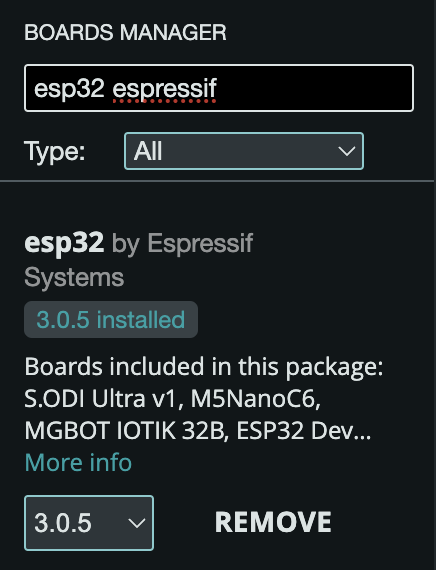
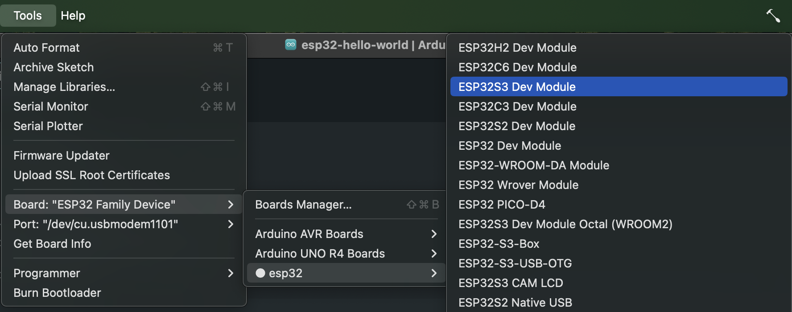
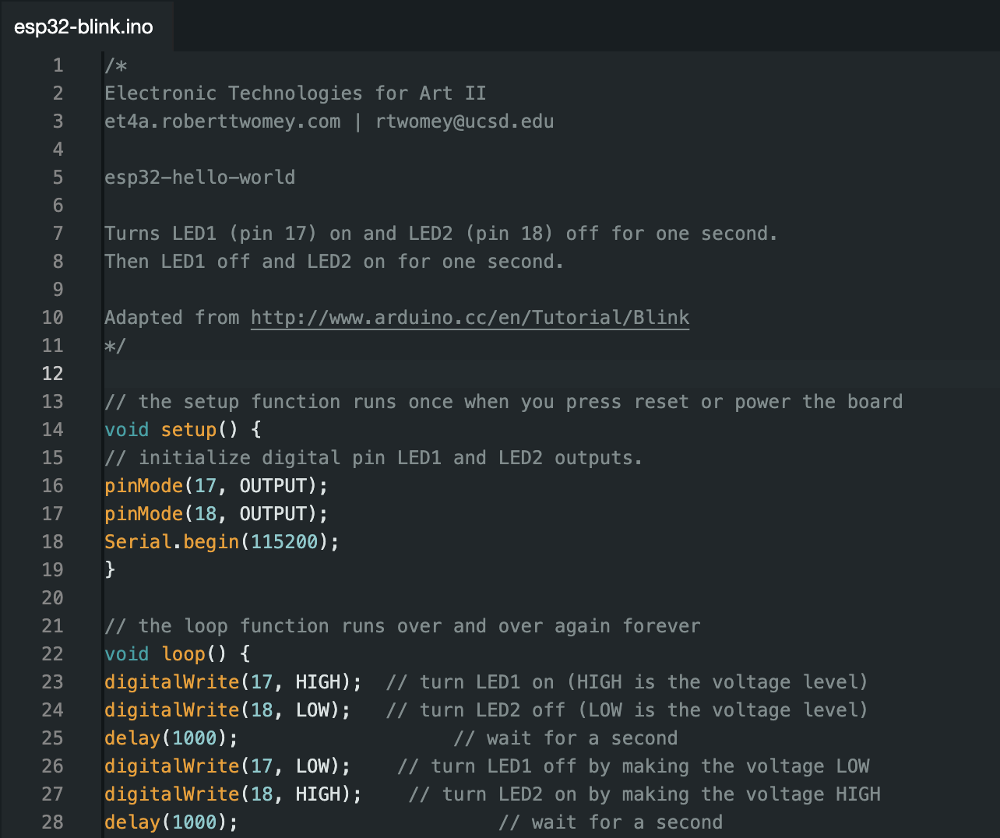
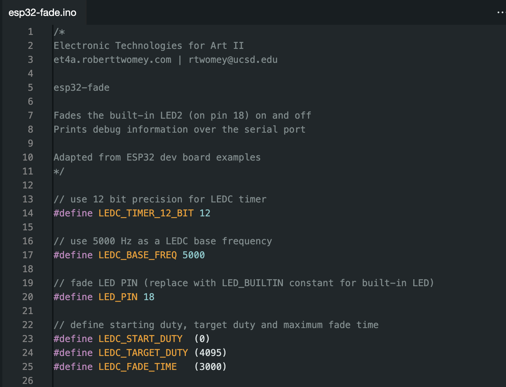

# Week 4 - Sensors and Sensations

## Agenda

- [Artist of the Day](#artist-of-the-day)
- Project 1 Critique
- Discuss: E.A.T.
- Hands-On
  - Introduce Tools of Imagination - ESP32 Dev Board
- [Homework](#homework)

## Artist of the Day 

You! Today we are critiquing/discussing your projects.

## Discuss EAT

Discuss Experiments in Art and Technology reading.

## Hands-On

ESP32 Dev Board

### Setup

1. In **Tools -> Board: -> Boards Manager** install the esp32 board definition from Espressif:
  -  
2. Connect your board via USB-C. 
3. Under **Tools -> Board:** select **ESP32S3 Dev Module**
  - 
4. Under **Tools** select **USB CDC on Boot:** to **enabled** (this enables the serial monitor and serial port)
  - 

### Hello World

[esp32-hello-world.zip](../assets/esp32-hello-world.zip)

Prints basic info about the board to the serial monitor.

### Blink

[esp32-blink.zip](../assets/esp32-blink.zip)

Turns LED1 (pin 17) on and LED2 (pin 18) off for one second. 
Then LED1 off and LED2 on for one second. 

### Fade

[esp32-fade.zip](../assets/esp32-fade.zip)

Fades LED2 (pin 18) on and off. 

<!--
### Input

[esp32-input.zip](../assets/esp32-input.zip)
-->

## Homework
- Reading + Activity: [Exhausting a Place](https://canvas.ucsd.edu/courses/60624/assignments/863268) DUE 10/30.

## References

- Tool for Imagination [ESP32 Dev Board Document](../assets/DEV_BOARD_DOCUMENT.pdf)